# Execution Topology and Coordination Failure in Fixed-Plan Multi-Agent Execution

## Experiment

The primary question is how the degree of parallelism in a fixed execution plan affects task outcome. The secondary question is what exactly breaks when it does: for every failed run we localize the first failing node and classify the cause - stale reads of shared state, concurrent writes to the same artifact, premature consumption of incomplete upstream output, or plain node-level error. A small side experiment varies the quality of the model that writes the plan against the quality of the model that executes it.

A harness model reads a frozen task description and emits a task decomposition as a dependency graph. The decomposition is rendered into three topologies: sequential (a topological serialization), parallel (execution respecting the declared dependencies), and over-parallel (dependencies deliberately cut by a fixed rule, forcing concurrency the decomposition does not license). The graph is executed as-is by an agent model, one API call per node, with no runtime replanning. Execution runs on LangGraph, whose superstep model gives concurrency deterministic semantics: all nodes scheduled in the same superstep read an identical state snapshot, and their writes commit only at the superstep boundary. Coordination failures are therefore reproducible properties of a schedule, not outcomes of API timing races. Parallelism is the only variable that changes between renderings of the same decomposition; any outcome difference across the three topologies of one graph is attributable to execution order and concurrency alone.

Workers have no tools. A worker sees the task description, the current contents of the files its node declares in `reads`, the outputs of the nodes it declares in `deps`, and its instruction. Declared read and write sets are the state-access discipline under study: a stale read occurs when a sibling overwrites a file after a node's reads were resolved, and premature consumption occurs when a node runs before a declared dep has produced its output.

Per node we record input and output tokens, wall-clock time, the raw model output, and which conditional branch fired. Per run we record the first failing node, the failure classification, total cost, and total time. A run is graded as resolved when the produced diff applies cleanly at the base commit and the instance's FAIL_TO_PASS tests pass in a virtual environment of the repository.

## Failure analysis

Failures are read from the execution trace, not from the final grade alone. Each failed run receives a location (the first node whose output violates its contract) and a cause from a fixed vocabulary:

- **stale read** - a node consumed shared state that a concurrent sibling had already superseded
- **write conflict** - two concurrent nodes produced incompatible edits to the same artifact
- **premature consumption** - a node ran before its logical input was complete because the dependency expressing that order was cut
- **node error** - the node failed on its own input, independent of concurrency
- **plan defect** - the decomposition itself was wrong; no execution order could have succeeded

The first three are coordination failures and should appear only in the parallel and over-parallel renderings. The last two are capability failures and should be topology-invariant. The mapping from failure to cause, correlated with parallelism level, is the core result.

## Side experiment: harness quality vs agent quality

Three configurations run the grid: weak harness with strong agent, strong harness with weak agent, weak harness with weak agent. Opus 4.8 is the strong model, Haiku 4.5 the weak one. The weak-harness graphs are shared between the two weak-harness configurations, so differences within those cells are attributable to the executor alone. The grid is 2 tasks x 2 harness models x 3 topologies, giving 12 distinct graphs and 18 executions.

## Task selection

The tasks were selected on one axis: how much of the information required to write a correct plan is available in the problem statement, before any code is read. In a fixed-graph regime the plan cannot be revised during execution, so plan-time information availability should determine whether a frozen graph can succeed at all. One task sits at each end of the axis.

Secondary criteria: both tasks come from pure-Python repositories, so grading requires no compiled dependencies, and both admit a natural multi-step decomposition, so the parallel renderings are meaningful rather than degenerate.

## Task descriptions

**Task 1 - django__django-11099.** Django's ASCIIUsernameValidator and UnicodeUsernameValidator anchor their regular expressions with `^` and `$`. In Python, `$` also matches immediately before a trailing newline, so usernames ending in a newline are accepted. The fix replaces the anchors with `\A` and `\Z` in both validator classes. The problem statement names the defective classes, the mechanism, and the correction; the plan can be fully specified before execution. Both classes live in the same source file, so an over-parallel rendering places two concurrent edits on one file. Task 1 is the probe for coordination failure: the sequential rendering should succeed, and any over-parallel failure is attributable to concurrent state access rather than to model capability.

**Task 2 - sympy__sympy-18087.** SymPy's `simplify` returns an incorrect result for `cos(x) + sqrt(sin(x)**2)` when `x` is a general complex symbol, silently treating `sqrt(sin(x)**2)` as `sin(x)`. The problem statement reports the symptom only. The reference fix is confined to `sympy/core/exprtools.py`, in `Factors.as_expr`, where non-integer exponents are mangled during base-exponent recombination - two modules away from the trig simplification code where the symptom surfaces. A correct plan therefore depends on localization work that can only happen during execution, which a frozen graph cannot incorporate. Task 2 is the probe for plan-quality failure: we expect mis-localization at plan time that cascades through downstream nodes regardless of topology.

I recommend we index the findings by these task characteristics - concurrent state access on Task 1, plan-time information deficit on Task 2 - rather than by the instances themselves.

## Generated decompositions

Each harness model received the identical frozen prompt (`prompts/orchestrator_prompt.txt` + the task context) in a single-turn Workbench run at temperature 0. The four decompositions, dependency edges as declared:

### django__django-11099 - Opus harness (3 nodes)

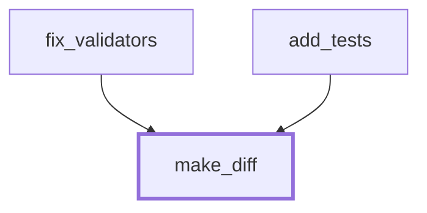

### django__django-11099 - Haiku harness (8 nodes)

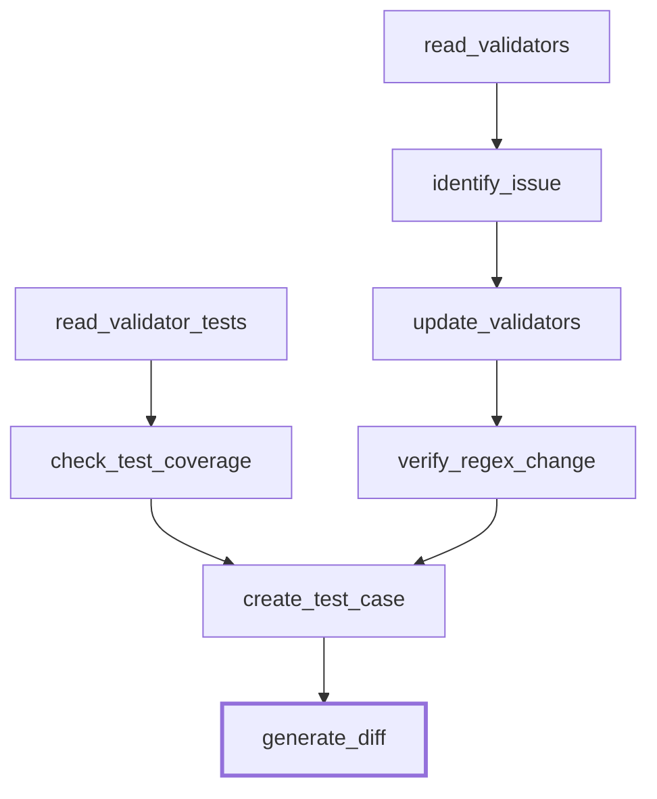

### sympy__sympy-18087 - Opus harness (6 nodes)

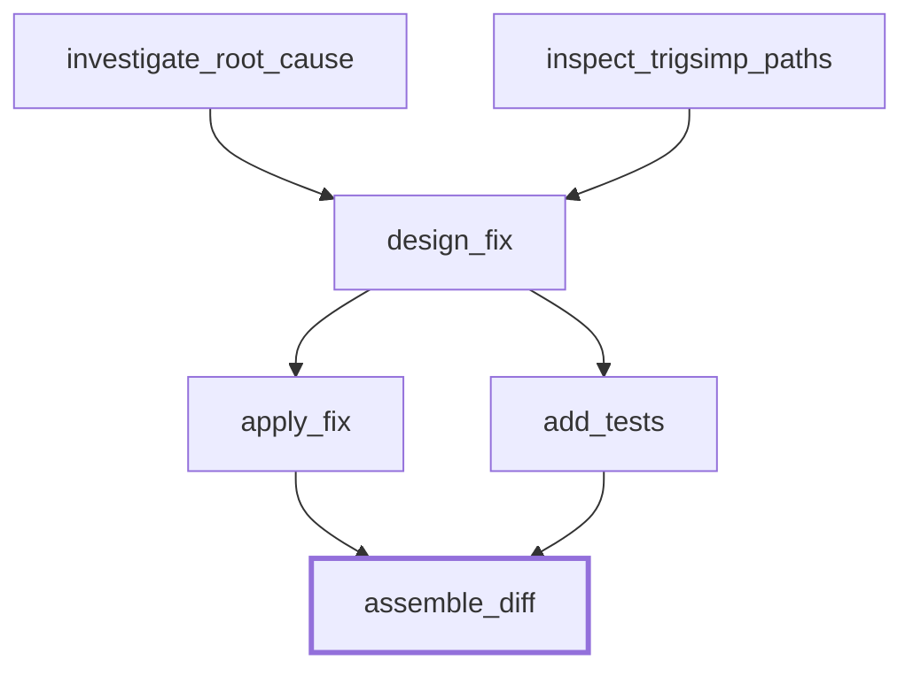

### sympy__sympy-18087 - Haiku harness (10 nodes)

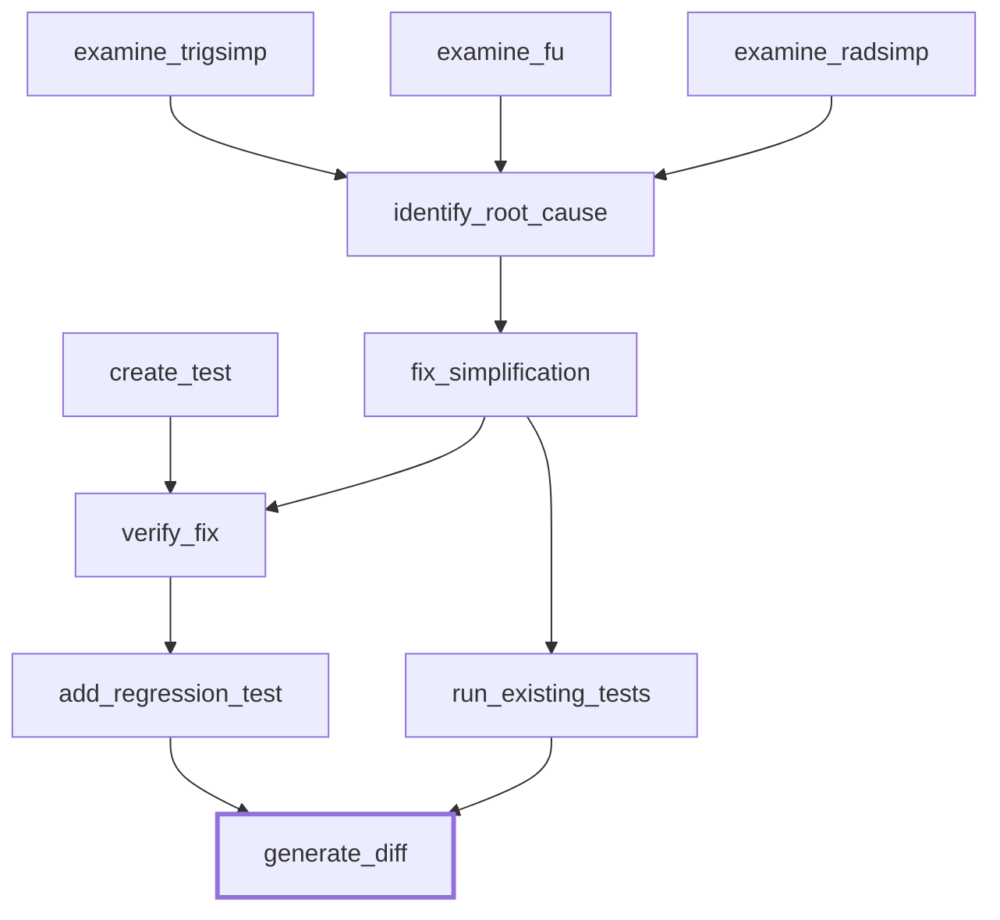

### Observations at plan time

- The strong harness produced 3 and 6 nodes; the weak harness produced 8 and 10. The extra weak-harness nodes are read-only inspection and verification steps. Two of the weak harness's sympy nodes (`verify_fix`, `run_existing_tests`) instruct the worker to run tests - an action the runtime does not provide. Those workers can only emit text asserting results.
- No harness used a guard on any node. All 32 nodes are unconditional.
- Localization on Task 2: the reference fix lives in `sympy/core/exprtools.py`. The strong harness committed its entire plan to `sympy/simplify/fu.py`, naming a specific helper; the weak harness spread its reads across `trigsimp.py`, `fu.py`, and `radsimp.py`. Neither declared `exprtools.py`. Both plans are mis-localized before any execution, differing only in confidence.
- On Task 1 the strong harness declared `add_tests` with no dependency on `fix_validators` while reading the file `fix_validators` writes. The declared-parallel rendering schedules both in the first superstep, so `add_tests` deterministically reads the unfixed `validators.py` on every run - a stale-read site inside a graph the harness itself declared safe to parallelize.
- Output hygiene: the strong harness emitted raw regex backslashes that are invalid JSON escapes; the weak harness wrapped one output in `<json>` tags. The loader repairs both mechanically and logs every repair.

## Topology rendering

Dependencies carry two roles: data (a node's prompt includes the outputs of its deps) and order (a node starts only after its deps complete). The renderings vary the order role only; the data role is fixed by the declaration in all three. Rendering is mechanical and deterministic - ties break lexicographically by node id.

- **sequential** - a total order extending the dependency partial order, one node at a time. Every declared dep completes before its consumer starts.
- **parallel** - the declared DAG. A node starts when all its deps have completed. Concurrency is exactly what the harness licensed.
- **over-parallel** - every ordering constraint is cut except the barrier before the final node: all non-final nodes start simultaneously; the final node waits for all of them. A cut dep still defines data flow, but a dep that has not completed when its consumer starts injects nothing, and the omission is logged as a premature-consumption site. Reads resolve against the state snapshot at the start of the node's superstep, so a file rewritten by a same-superstep sibling is read in its pre-write version - a stale read that occurs deterministically, on every run of that schedule.

No decomposition declared a guard, so guard semantics under cut dependencies do not arise in this run of the experiment.

In the diagrams below, solid arrows are enforced ordering constraints; dotted arrows are declared data dependencies whose ordering the rendering removed.

## Rendered topologies

<!-- TOPOLOGIES:BEGIN -->

### django__django-11099 - opus harness

**sequential** - 3 waves, max width 1

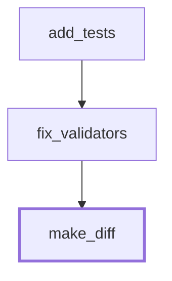

**parallel** - 2 waves, max width 2

**overparallel** - 2 waves, max width 2

### django__django-11099 - haiku harness

**sequential** - 8 waves, max width 1

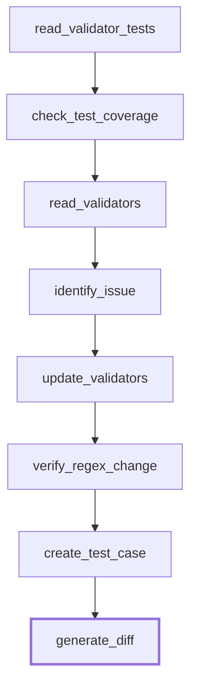

**parallel** - 6 waves, max width 2

**overparallel** - 2 waves, max width 7

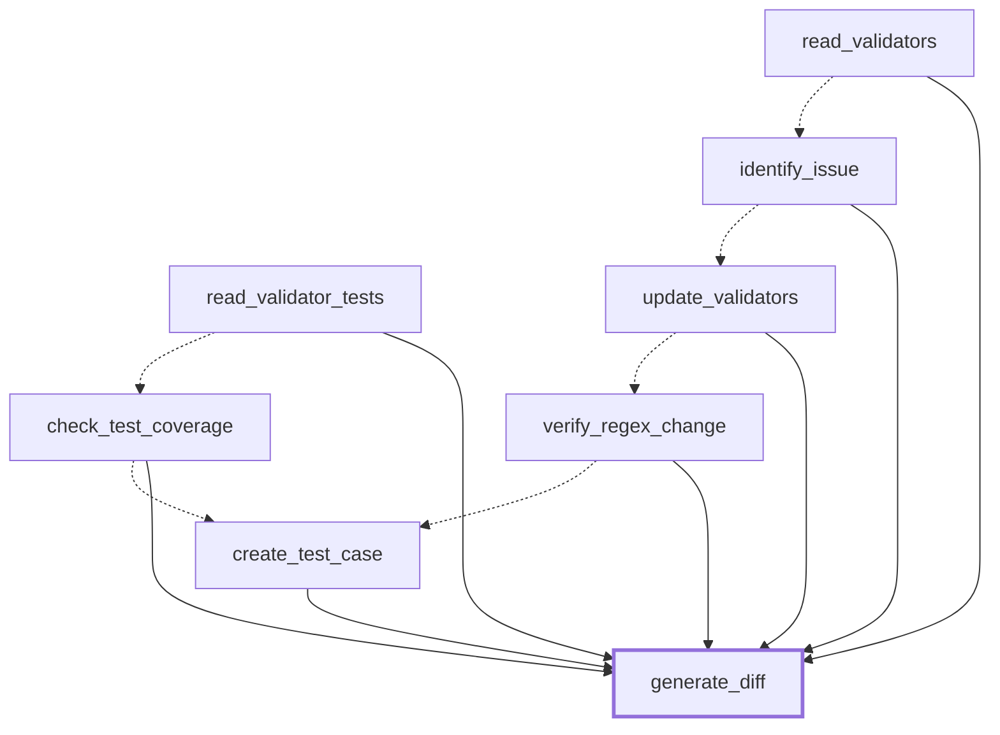

### sympy__sympy-18087 - opus harness

**sequential** - 6 waves, max width 1

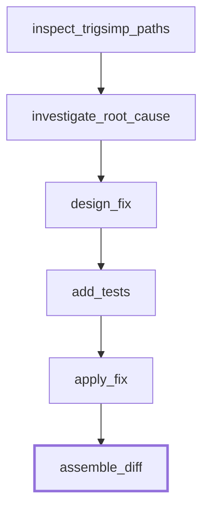

**parallel** - 4 waves, max width 2

**overparallel** - 2 waves, max width 5

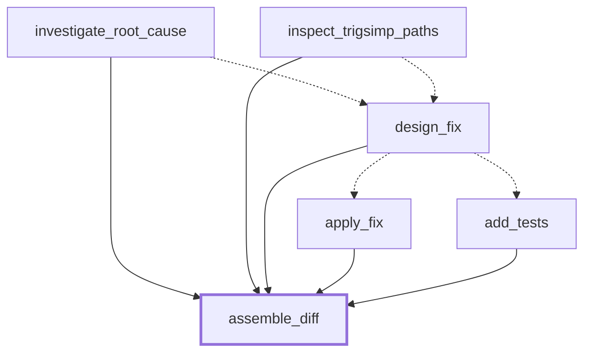

### sympy__sympy-18087 - haiku harness

**sequential** - 10 waves, max width 1

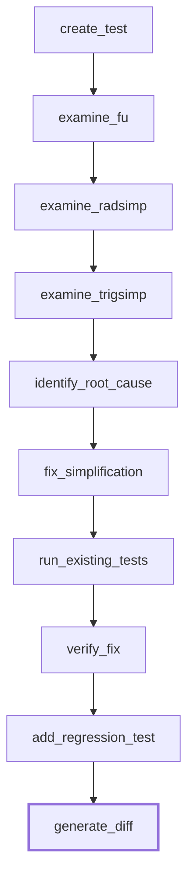

**parallel** - 6 waves, max width 4

**overparallel** - 2 waves, max width 9

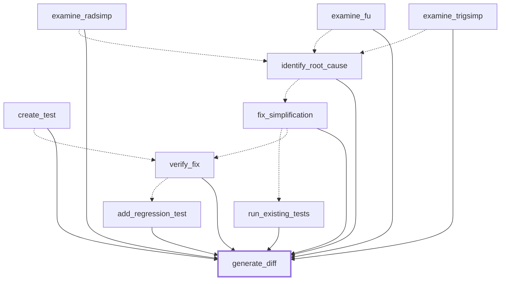

<!-- TOPOLOGIES:END -->

## Results

<!-- RESULTS:BEGIN -->

### Run outcomes

| task | harness | agent | topology | wall (s) | cost ($) | node errors | premature | stale reads | applies | gold tests apply |
|---|---|---|---|---|---|---|---|---|---|---|
| django | haiku | haiku | sequential | 70.89 | 0.1007 | 0 | 0 | 0 | False | False |
| django | haiku | haiku | parallel | 52.89 | 0.0872 | 0 | 0 | 0 | False | False |
| django | haiku | haiku | overparallel | 30.96 | 0.0844 | 0 | 5 | 3 | False | False |
| django | haiku | opus | sequential | 123.6 | 0.5781 | 0 | 0 | 0 | False | False |
| django | haiku | opus | parallel | 95.3 | 0.5748 | 0 | 0 | 0 | True | False |
| django | haiku | opus | overparallel | 51.09 | 0.429 | 0 | 5 | 3 | False | False |
| django | opus | haiku | sequential | 34.06 | 0.0483 | 0 | 0 | 0 | False | False |
| django | opus | haiku | parallel | 33.04 | 0.0474 | 0 | 0 | 1 | False | False |
| django | opus | haiku | overparallel | 27.52 | 0.0351 | 0 | 0 | 1 | False | False |
| sympy | haiku | haiku | sequential | 277.5 | 0.4881 | 1 | 0 | 0 | False | False |
| sympy | haiku | haiku | parallel | 476.91 | 0.7176 | 1 | 0 | 0 | False | False |
| sympy | haiku | haiku | overparallel | 223.31 | 0.4623 | 0 | 5 | 5 | False | False |
| sympy | haiku | opus | sequential | 507.35 | 3.2504 | 0 | 0 | 0 | False | False |
| sympy | haiku | opus | parallel | 482.04 | 3.3984 | 0 | 0 | 0 | False | False |
| sympy | haiku | opus | overparallel | 284.57 | 2.8665 | 0 | 5 | 5 | False | False |
| sympy | opus | haiku | sequential | 366.5 | 0.405 | 0 | 0 | 0 | False | False |
| sympy | opus | haiku | parallel | 240.15 | 0.3917 | 1 | 0 | 0 | False | False |
| sympy | opus | haiku | overparallel | 203.9 | 0.2984 | 0 | 3 | 2 | False | False |

### Coordination events by run

**django / haiku harness / haiku agent / overparallel**
- stale read: `read_validator_tests` read `tests/auth_tests/test_validators.py` while `create_test_case` rewrote it in the same superstep
- stale read: `read_validators` read `django/contrib/auth/validators.py` while `update_validators` rewrote it in the same superstep
- stale read: `verify_regex_change` read `django/contrib/auth/validators.py` while `update_validators` rewrote it in the same superstep
- premature consumption at `check_test_coverage`
- premature consumption at `create_test_case`
- premature consumption at `identify_issue`
- premature consumption at `update_validators`
- premature consumption at `verify_regex_change`

**django / haiku harness / opus agent / overparallel**
- stale read: `read_validator_tests` read `tests/auth_tests/test_validators.py` while `create_test_case` rewrote it in the same superstep
- stale read: `read_validators` read `django/contrib/auth/validators.py` while `update_validators` rewrote it in the same superstep
- stale read: `verify_regex_change` read `django/contrib/auth/validators.py` while `update_validators` rewrote it in the same superstep
- premature consumption at `check_test_coverage`
- premature consumption at `create_test_case`
- premature consumption at `identify_issue`
- premature consumption at `update_validators`
- premature consumption at `verify_regex_change`

**django / opus harness / haiku agent / parallel**
- stale read: `add_tests` read `django/contrib/auth/validators.py` while `fix_validators` rewrote it in the same superstep

**django / opus harness / haiku agent / overparallel**
- stale read: `add_tests` read `django/contrib/auth/validators.py` while `fix_validators` rewrote it in the same superstep

**sympy / haiku harness / haiku agent / sequential**
- node error at `fix_simplification`

**sympy / haiku harness / haiku agent / parallel**
- node error at `fix_simplification`

**sympy / haiku harness / haiku agent / overparallel**
- stale read: `examine_fu` read `sympy/simplify/fu.py` while `fix_simplification` rewrote it in the same superstep
- stale read: `identify_root_cause` read `sympy/simplify/fu.py` while `fix_simplification` rewrote it in the same superstep
- stale read: `run_existing_tests` read `sympy/simplify/tests/test_trigsimp.py` while `add_regression_test` rewrote it in the same superstep
- stale read: `run_existing_tests` read `sympy/simplify/fu.py` while `fix_simplification` rewrote it in the same superstep
- stale read: `verify_fix` read `sympy/simplify/fu.py` while `fix_simplification` rewrote it in the same superstep
- premature consumption at `add_regression_test`
- premature consumption at `fix_simplification`
- premature consumption at `identify_root_cause`
- premature consumption at `run_existing_tests`
- premature consumption at `verify_fix`

**sympy / haiku harness / opus agent / overparallel**
- stale read: `examine_fu` read `sympy/simplify/fu.py` while `fix_simplification` rewrote it in the same superstep
- stale read: `identify_root_cause` read `sympy/simplify/fu.py` while `fix_simplification` rewrote it in the same superstep
- stale read: `run_existing_tests` read `sympy/simplify/tests/test_trigsimp.py` while `add_regression_test` rewrote it in the same superstep
- stale read: `run_existing_tests` read `sympy/simplify/fu.py` while `fix_simplification` rewrote it in the same superstep
- stale read: `verify_fix` read `sympy/simplify/fu.py` while `fix_simplification` rewrote it in the same superstep
- premature consumption at `add_regression_test`
- premature consumption at `fix_simplification`
- premature consumption at `identify_root_cause`
- premature consumption at `run_existing_tests`
- premature consumption at `verify_fix`

**sympy / opus harness / haiku agent / parallel**
- node error at `add_tests`

**sympy / opus harness / haiku agent / overparallel**
- stale read: `design_fix` read `sympy/simplify/fu.py` while `apply_fix` rewrote it in the same superstep
- stale read: `investigate_root_cause` read `sympy/simplify/fu.py` while `apply_fix` rewrote it in the same superstep
- premature consumption at `add_tests`
- premature consumption at `apply_fix`
- premature consumption at `design_fix`

<!-- RESULTS:END -->

## Analysis

(to be written from the joined tables)
