# Execution Topology and Coordination Failure in Fixed-Plan Multi-Agent Execution

## About this document

This is the experiment record for **topo-lab**, the evaluation harness behind the paper *[PAPER TITLE]* ([VENUE], [YEAR]). Every reference below to "the paper", "Figure 1", or "the running example" refers to that paper. The paper states the argument; this document holds the design decisions, the full run tables, and the failure traces behind the numbers it reports.

Each run executes a fixed task decomposition as a dependency graph of LLM worker nodes on LangGraph, one API call per node, with no runtime replanning. The same decomposition is rendered into several execution topologies that differ only in how much ordering is enforced, so any outcome difference across renderings is attributable to the schedule alone.

All tables and diagrams below are generated by the scripts in `scripts/` and regenerated in place between the `TOPOLOGIES`, `RESULTS`, and `ADDITIONAL` markers. Prose outside those markers is written by hand.

## Design

The primary question is how the degree of parallelism in a fixed execution plan affects task outcome. The secondary question is what exactly breaks when it does: for every failed run we localize the first failing node and classify the cause - stale reads of shared state, concurrent writes to the same artifact, premature consumption of incomplete upstream output, or plain node-level error. A configuration grid varying harness-model and agent-model quality was run once; the follow-up gradient experiment fixes a single configuration justified from that grid.

A harness model reads a frozen task description and emits a task decomposition as a dependency graph. The decomposition is rendered into three topologies: sequential (a topological serialization), parallel (execution respecting the declared dependencies), and over-parallel (dependencies deliberately cut by a fixed rule, forcing concurrency the decomposition does not license). The graph is executed as-is by an agent model, one API call per node, with no runtime replanning. Execution runs on LangGraph, whose superstep model gives concurrency deterministic semantics: all nodes scheduled in the same superstep read an identical state snapshot, and their writes commit only at the superstep boundary. Coordination failures are therefore reproducible properties of a schedule, not outcomes of API timing races. Parallelism is the only variable that changes between renderings of the same decomposition; any outcome difference across the three topologies of one graph is attributable to execution order and concurrency alone.

Workers have no tools. A worker sees the task description, the current contents of the files its node declares in `reads`, the outputs of the nodes it declares in `deps`, and its instruction. Declared read and write sets are the state-access discipline under study: a stale read occurs when a sibling overwrites a file after a node's reads were resolved, and premature consumption occurs when a node runs before a declared dep has produced its output.

Per node we record input and output tokens, wall-clock time, the raw model output, and which conditional branch fired. Per run we record the first failing node, the failure classification, total cost, and total time. A run is graded on the workspace state its agents produced, and is resolved when every FAIL_TO_PASS test of the instance passes in a virtual environment of the repository.

## Failure analysis

Failures are read from the execution trace, not from the final grade alone. Each failed run receives a location (the first node whose output violates its contract) and a cause from a fixed vocabulary:

- **stale read** - a node consumed shared state that a concurrent sibling had already superseded
- **write conflict** - two concurrent nodes produced incompatible edits to the same artifact
- **premature consumption** - a node ran before its logical input was complete because the dependency expressing that order was cut
- **node error** - the node failed on its own input, independent of concurrency
- **plan defect** - the decomposition itself was wrong; no execution order could have succeeded

The first three are coordination failures and should appear only in the parallel and over-parallel renderings. The last two are capability failures and should be topology-invariant. The mapping from failure to cause, correlated with parallelism level, is the core result.

## Task selection

The tasks were selected on one axis: how much of the information required to write a correct plan is available in the problem statement, before any code is read. In a fixed-graph regime the plan cannot be revised during execution, so plan-time information availability should determine whether a frozen graph can succeed at all. One task sits at each end of the axis.

Secondary criteria: both tasks come from pure-Python repositories, so grading requires no compiled dependencies, and both admit a natural multi-step decomposition, so the parallel renderings are meaningful rather than degenerate.

## Task descriptions

**Task 1 - django__django-11099.** Django's ASCIIUsernameValidator and UnicodeUsernameValidator anchor their regular expressions with `^` and `$`. In Python, `$` also matches immediately before a trailing newline, so usernames ending in a newline are accepted. The fix replaces the anchors with `\A` and `\Z` in both validator classes. The problem statement names the defective classes, the mechanism, and the correction; the plan can be fully specified before execution. Both classes live in the same source file, so an over-parallel rendering places two concurrent edits on one file. Task 1 is the probe for coordination failure: the sequential rendering should succeed, and any over-parallel failure is attributable to concurrent state access rather than to model capability.

**Task 2 - sympy__sympy-18087.** SymPy's `simplify` returns an incorrect result for `cos(x) + sqrt(sin(x)**2)` when `x` is a general complex symbol, silently treating `sqrt(sin(x)**2)` as `sin(x)`. The problem statement reports the symptom only. The reference fix is confined to `sympy/core/exprtools.py`, in `Factors.as_expr`, where non-integer exponents are mangled during base-exponent recombination - two modules away from the trig simplification code where the symptom surfaces. A correct plan therefore depends on localization work that can only happen during execution, which a frozen graph cannot incorporate. Task 2 is the probe for plan-quality failure: we expect mis-localization at plan time that cascades through downstream nodes regardless of topology.

Findings are indexed by these task characteristics - concurrent state access on Task 1, plan-time information deficit on Task 2 - rather than by the instances themselves.

## Generated decompositions

Each harness model received the identical frozen prompt (`prompts/orchestrator_prompt.txt` + the task context) in a single-turn Workbench run at temperature 0. The four decompositions, dependency edges as declared:

### django__django-11099 - Opus harness (3 nodes)

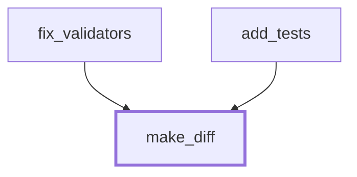

### django__django-11099 - Haiku harness (8 nodes)

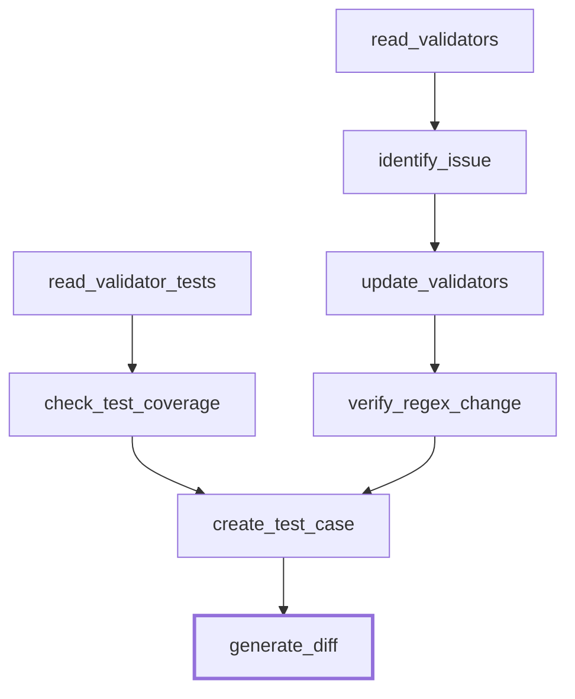

### sympy__sympy-18087 - Opus harness (6 nodes)

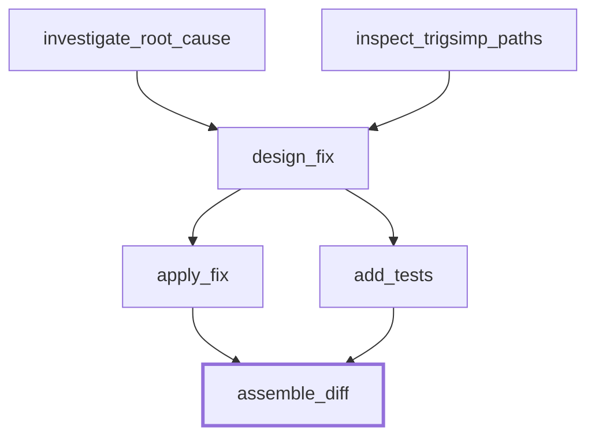

### sympy__sympy-18087 - Haiku harness (10 nodes)

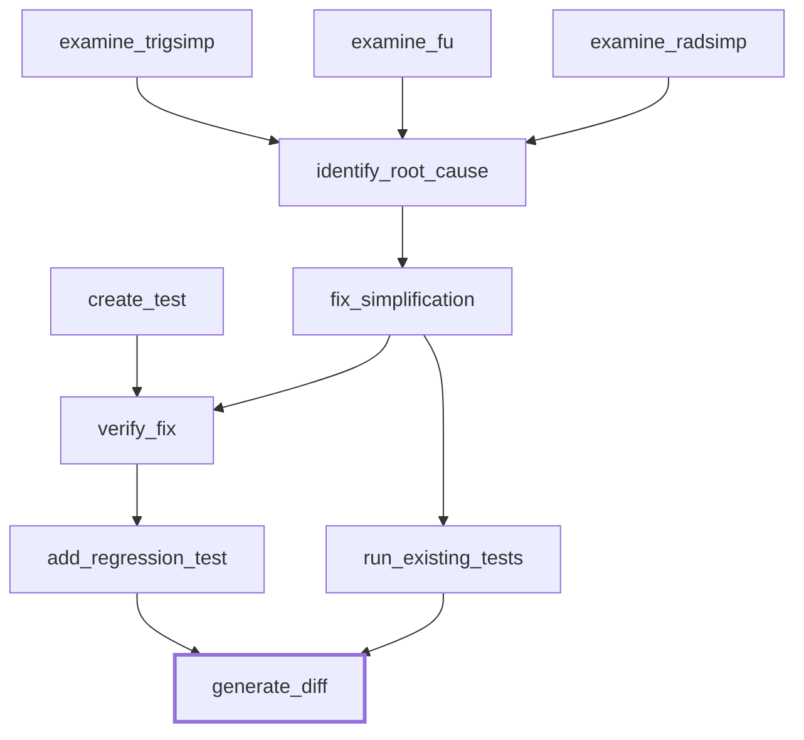

### Observations at plan time

- The strong harness produced 3 and 6 nodes; the weak harness produced 8 and 10. The extra weak-harness nodes are read-only inspection and verification steps. Two of the weak harness's sympy nodes (`verify_fix`, `run_existing_tests`) instruct the worker to run tests - an action the runtime does not provide. Those workers can only emit text asserting results.
- No harness used a guard on any node. All 32 nodes are unconditional.
- Localization on Task 2: the reference fix lives in `sympy/core/exprtools.py`. The strong harness committed its entire plan to `sympy/simplify/fu.py`, naming a specific helper; the weak harness spread its reads across `trigsimp.py`, `fu.py`, and `radsimp.py`. Neither declared `exprtools.py`. Both plans are mis-localized before any execution, differing only in confidence.
- On Task 1 the strong harness declared `add_tests` with no dependency on `fix_validators` while reading the file `fix_validators` writes. The declared-parallel rendering schedules both in the first superstep, so `add_tests` deterministically reads the unfixed `validators.py` on every run - a stale-read site inside a graph the harness itself declared safe to parallelize.
- Output hygiene: the strong harness emitted raw regex backslashes that are invalid JSON escapes; the weak harness wrapped one output in `<json>` tags. The loader repairs both mechanically and logs every repair.

## Topology rendering

Dependencies carry two roles: data (a node's prompt includes the outputs of its deps) and order (a node starts only after its deps complete). The renderings vary the order role only; the data role is fixed by the declaration in all three. Rendering is mechanical and deterministic - ties break lexicographically by node id.

- **sequential** - a total order extending the dependency partial order, one node at a time. Every declared dep completes before its consumer starts.
- **parallel** - the declared DAG. A node starts when all its deps have completed. Concurrency is exactly what the harness licensed.
- **over-parallel** - every ordering constraint is cut except the barrier before the final node: all non-final nodes start simultaneously; the final node waits for all of them. A cut dep still defines data flow, but a dep that has not completed when its consumer starts injects nothing, and the omission is logged as a premature-consumption site. Reads resolve against the state snapshot at the start of the node's superstep, so a file rewritten by a same-superstep sibling is read in its pre-write version - a stale read that occurs deterministically, on every run of that schedule.

No decomposition declared a guard, so guard semantics under cut dependencies do not arise in this run of the experiment.

In the diagrams below, solid arrows are enforced ordering constraints; dotted arrows are declared data dependencies whose ordering the rendering removed.

## Rendered topologies

<!-- TOPOLOGIES:BEGIN -->

### django__django-11099 - haiku harness

**sequential** - 8 waves, max width 1

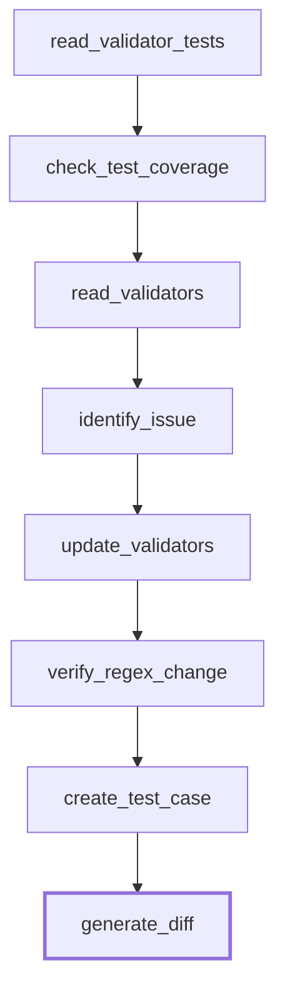

**parallel** - 6 waves, max width 2


**overparallel** - 2 waves, max width 7

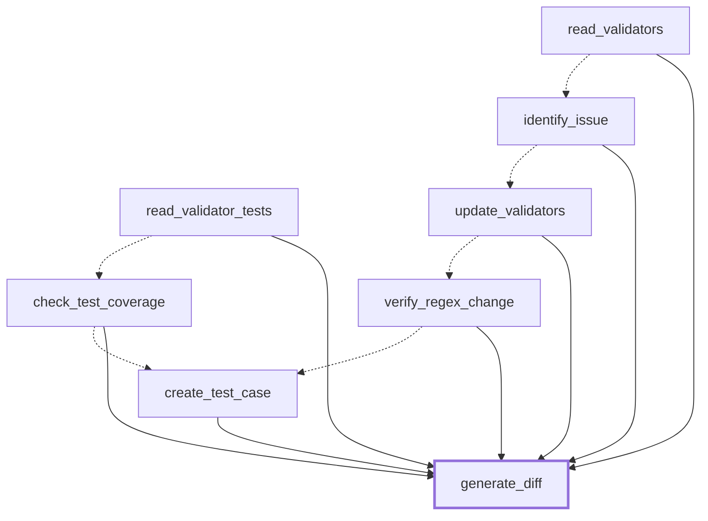

### django__django-11099 - opus harness

**sequential** - 3 waves, max width 1

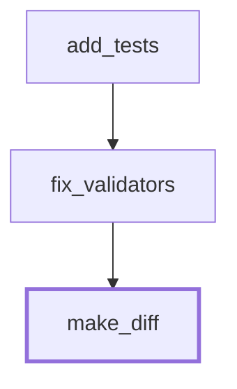

**parallel** - 2 waves, max width 2


**overparallel** - 2 waves, max width 2


### sympy__sympy-18087 - haiku harness

**sequential** - 10 waves, max width 1

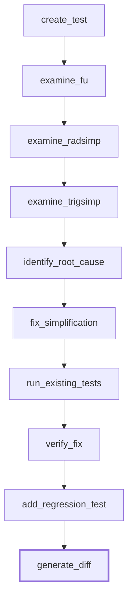

**parallel** - 6 waves, max width 4


**overparallel** - 2 waves, max width 9

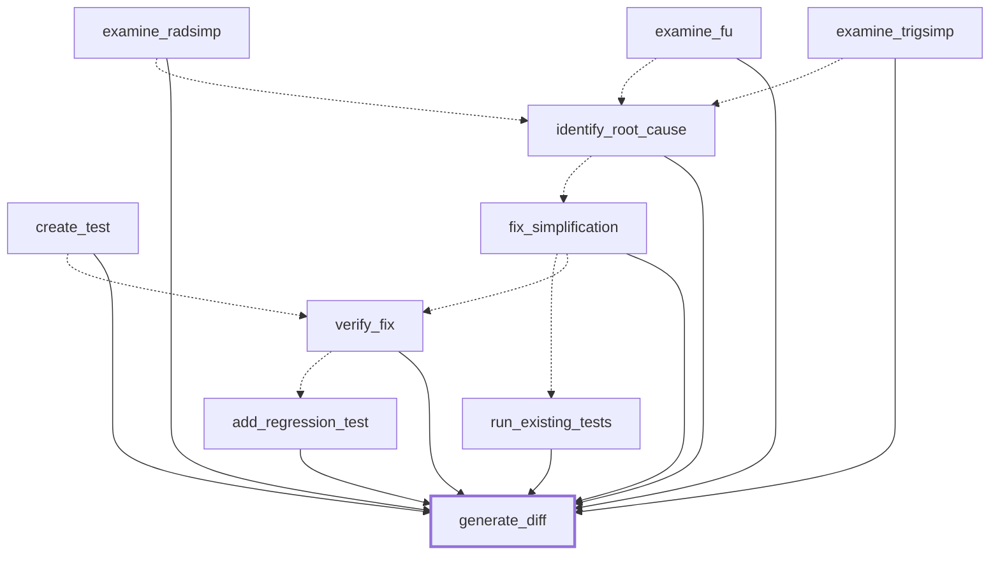

### sympy__sympy-18087 - opus harness

**sequential** - 6 waves, max width 1

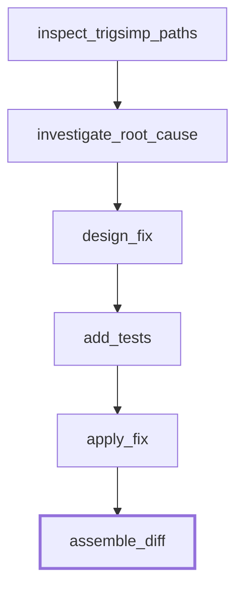

**parallel** - 4 waves, max width 2


**overparallel** - 2 waves, max width 5

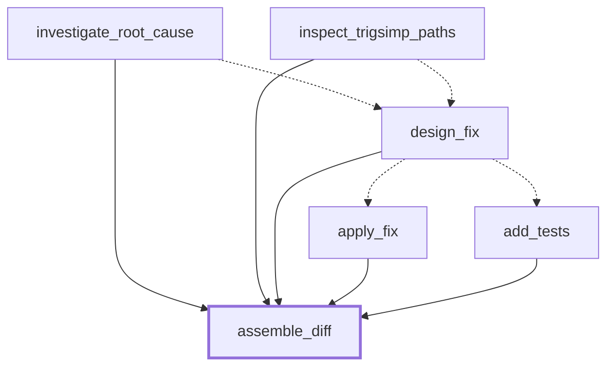

<!-- TOPOLOGIES:END -->

## Accuracy metric

Each run is graded on two deliverables. The primary deliverable is mechanical: the git diff of the workspace state the agents actually produced against the base commit, computed in a throwaway worktree, with files touched by the instance's gold test patch excluded so the gold tests always apply on top. This is the state that coordination acts on - a stale read or write conflict corrupts or preserves the workspace, not a model's later description of it. The secondary deliverable is the unified diff the final node emitted from memory; grading it alone conflates diff-fabrication ability with task outcome, and it is retained for comparison under "emitted" in the grade record.

Three quantities are reported per deliverable. resolved - every FAIL_TO_PASS test of the instance passes, each test executed in its own interpreter invocation in a virtual environment of the repository. f2p - the fraction of FAIL_TO_PASS tests passing, the graded correctness axis. content - the fraction of the task rubric present in the patch text (django: both anchor replacements; sympy: any modification of core/exprtools.py), independent of test outcome.

A 0-4 stage ladder is retained in `grades.json` for the record but is not reported: for the mechanical deliverable, stages 1 and 2 are dead by construction - git generated the diff at the base commit, and gold-test files were excluded - so the ladder carries no information beyond whether a workspace diff exists at all.

Before grading, the emitted diff is normalized mechanically - markdown fences stripped, line endings normalized - with the repair logged and the raw output preserved unmodified. The mechanical diff needs no repair. This is instrument repair, not data adjustment.

## Results

<!-- RESULTS:BEGIN -->

### Run grid

content: fraction of the task rubric present in the patch. f2p: FAIL_TO_PASS tests passing / total. resolved: every FAIL_TO_PASS test passes. tokens: input + output tokens summed over nodes, prompt-cache reads excluded. All grades apply to the mechanical deliverable (the workspace diff).

| task | harness | agent | topology | wall (s) | cost ($) | tokens | node errors | premature consumptions | stale reads | write conflicts | content | f2p | resolved |
|---|---|---|---|---|---|---|---|---|---|---|---|---|---|
| django-11099 | haiku | haiku | sequential | 70.89 | 0.1007 | 31998 | 0 | 0 | 0 | 0 | 1.0 | 3/3 | yes |
| django-11099 | haiku | haiku | parallel | 52.89 | 0.0872 | 27679 | 0 | 0 | 0 | 0 | 1.0 | 3/3 | yes |
| django-11099 | haiku | haiku | overparallel | 30.96 | 0.0844 | 24448 | 0 | 5 | 3 | 0 | 1.0 | 3/3 | yes |
| django-11099 | haiku | opus | sequential | 123.6 | 0.5781 | 36610 | 0 | 0 | 0 | 0 | 1.0 | 3/3 | yes |
| django-11099 | haiku | opus | parallel | 95.3 | 0.5748 | 36428 | 0 | 0 | 0 | 0 | 1.0 | 3/3 | yes |
| django-11099 | haiku | opus | overparallel | 51.09 | 0.429 | 31856 | 0 | 5 | 3 | 0 | 1.0 | 3/3 | yes |
| django-11099 | opus | haiku | sequential | 34.06 | 0.0483 | 14990 | 0 | 0 | 0 | 0 | 1.0 | 3/3 | yes |
| django-11099 | opus | haiku | parallel | 33.04 | 0.0474 | 14716 | 0 | 0 | 1 | 0 | 1.0 | 3/3 | yes |
| django-11099 | opus | haiku | overparallel | 27.52 | 0.0351 | 12794 | 0 | 0 | 1 | 0 | 1.0 | 3/3 | yes |
| sympy-18087 | haiku | haiku | sequential | 277.5 | 0.4881 | 321191 | 1 | 0 | 0 | 0 | 0.0 | 0/2 | no |
| sympy-18087 | haiku | haiku | parallel | 476.91 | 0.7176 | 404133 | 1 | 0 | 0 | 0 | 0.0 | 0/2 | no |
| sympy-18087 | haiku | haiku | overparallel | 223.31 | 0.4623 | 269945 | 0 | 5 | 5 | 0 | 0.0 | 0/2 | no |
| sympy-18087 | haiku | opus | sequential | 507.35 | 3.2504 | 423244 | 0 | 0 | 0 | 0 | 0.0 | 0/2 | no |
| sympy-18087 | haiku | opus | parallel | 482.04 | 3.3984 | 435050 | 0 | 0 | 0 | 0 | 0.0 | 0/2 | no |
| sympy-18087 | haiku | opus | overparallel | 284.57 | 2.8665 | 358611 | 0 | 5 | 5 | 0 | 0.0 | 0/2 | no |
| sympy-18087 | opus | haiku | sequential | 366.5 | 0.405 | 193834 | 0 | 0 | 0 | 0 | 0.0 | 0/2 | no |
| sympy-18087 | opus | haiku | parallel | 240.15 | 0.3917 | 190909 | 1 | 0 | 0 | 0 | 0.0 | 0/2 | no |
| sympy-18087 | opus | haiku | overparallel | 203.9 | 0.2984 | 153611 | 0 | 3 | 2 | 0 | 0.0 | 0/2 | no |

### Coordination events by run

**django-11099 / haiku harness / haiku agent / overparallel**
- stale read: `read_validator_tests` read `tests/auth_tests/test_validators.py` while `create_test_case` rewrote it in the same superstep
- stale read: `read_validators` read `django/contrib/auth/validators.py` while `update_validators` rewrote it in the same superstep
- stale read: `verify_regex_change` read `django/contrib/auth/validators.py` while `update_validators` rewrote it in the same superstep
- premature consumption at `check_test_coverage`
- premature consumption at `create_test_case`
- premature consumption at `identify_issue`
- premature consumption at `update_validators`
- premature consumption at `verify_regex_change`

**django-11099 / haiku harness / opus agent / overparallel**
- stale read: `read_validator_tests` read `tests/auth_tests/test_validators.py` while `create_test_case` rewrote it in the same superstep
- stale read: `read_validators` read `django/contrib/auth/validators.py` while `update_validators` rewrote it in the same superstep
- stale read: `verify_regex_change` read `django/contrib/auth/validators.py` while `update_validators` rewrote it in the same superstep
- premature consumption at `check_test_coverage`
- premature consumption at `create_test_case`
- premature consumption at `identify_issue`
- premature consumption at `update_validators`
- premature consumption at `verify_regex_change`

**django-11099 / opus harness / haiku agent / parallel**
- stale read: `add_tests` read `django/contrib/auth/validators.py` while `fix_validators` rewrote it in the same superstep

**django-11099 / opus harness / haiku agent / overparallel**
- stale read: `add_tests` read `django/contrib/auth/validators.py` while `fix_validators` rewrote it in the same superstep

**sympy-18087 / haiku harness / haiku agent / sequential**
- node error at `fix_simplification`

**sympy-18087 / haiku harness / haiku agent / parallel**
- node error at `fix_simplification`

**sympy-18087 / haiku harness / haiku agent / overparallel**
- stale read: `examine_fu` read `sympy/simplify/fu.py` while `fix_simplification` rewrote it in the same superstep
- stale read: `identify_root_cause` read `sympy/simplify/fu.py` while `fix_simplification` rewrote it in the same superstep
- stale read: `run_existing_tests` read `sympy/simplify/tests/test_trigsimp.py` while `add_regression_test` rewrote it in the same superstep
- stale read: `run_existing_tests` read `sympy/simplify/fu.py` while `fix_simplification` rewrote it in the same superstep
- stale read: `verify_fix` read `sympy/simplify/fu.py` while `fix_simplification` rewrote it in the same superstep
- premature consumption at `add_regression_test`
- premature consumption at `fix_simplification`
- premature consumption at `identify_root_cause`
- premature consumption at `run_existing_tests`
- premature consumption at `verify_fix`

**sympy-18087 / haiku harness / opus agent / overparallel**
- stale read: `examine_fu` read `sympy/simplify/fu.py` while `fix_simplification` rewrote it in the same superstep
- stale read: `identify_root_cause` read `sympy/simplify/fu.py` while `fix_simplification` rewrote it in the same superstep
- stale read: `run_existing_tests` read `sympy/simplify/tests/test_trigsimp.py` while `add_regression_test` rewrote it in the same superstep
- stale read: `run_existing_tests` read `sympy/simplify/fu.py` while `fix_simplification` rewrote it in the same superstep
- stale read: `verify_fix` read `sympy/simplify/fu.py` while `fix_simplification` rewrote it in the same superstep
- premature consumption at `add_regression_test`
- premature consumption at `fix_simplification`
- premature consumption at `identify_root_cause`
- premature consumption at `run_existing_tests`
- premature consumption at `verify_fix`

**sympy-18087 / opus harness / haiku agent / parallel**
- node error at `add_tests`

**sympy-18087 / opus harness / haiku agent / overparallel**
- stale read: `design_fix` read `sympy/simplify/fu.py` while `apply_fix` rewrote it in the same superstep
- stale read: `investigate_root_cause` read `sympy/simplify/fu.py` while `apply_fix` rewrote it in the same superstep
- premature consumption at `add_tests`
- premature consumption at `apply_fix`
- premature consumption at `design_fix`

### Repetition study (10 runs of django-11099 / haiku harness / overparallel, haiku agent)

A single run per configuration cannot distinguish behavior inherent to that configuration from sampling noise: the agent is sampled at nonzero temperature. One configuration was rerun ten times - the weak-harness django decomposition, over-parallel rendering, weak agent, chosen as the cheapest cell with the richest coordination-event set. Schedule-derived quantities (which files were read stale, which dependencies were consumed prematurely) are expected to repeat exactly; model-dependent quantities may vary.

| task | harness | agent | topology | wall (s) | cost ($) | tokens | node errors | premature consumptions | stale reads | write conflicts | content | f2p | resolved |
|---|---|---|---|---|---|---|---|---|---|---|---|---|---|
| django-11099 | haiku | haiku | overparallel | 34.22 | 0.0632 | 24455 | 0 | 5 | 3 | 0 | 1.0 | 3/3 | yes |
| django-11099 | haiku | haiku | overparallel | 31.82 | 0.0865 | 24845 | 0 | 5 | 3 | 0 | 1.0 | 3/3 | yes |
| django-11099 | haiku | haiku | overparallel | 32.04 | 0.086 | 25004 | 0 | 5 | 3 | 0 | 1.0 | 3/3 | yes |
| django-11099 | haiku | haiku | overparallel | 31.99 | 0.0851 | 24364 | 0 | 5 | 3 | 0 | 1.0 | 3/3 | yes |
| django-11099 | haiku | haiku | overparallel | 32.78 | 0.0869 | 25130 | 0 | 5 | 3 | 0 | 1.0 | 3/3 | yes |
| django-11099 | haiku | haiku | overparallel | 29.7 | 0.0833 | 23878 | 0 | 5 | 3 | 0 | 1.0 | 3/3 | yes |
| django-11099 | haiku | haiku | overparallel | 31.98 | 0.0882 | 25308 | 0 | 5 | 3 | 0 | 1.0 | 3/3 | yes |
| django-11099 | haiku | haiku | overparallel | 32.6 | 0.0852 | 24264 | 0 | 5 | 3 | 0 | 1.0 | 3/3 | yes |
| django-11099 | haiku | haiku | overparallel | 32.55 | 0.0853 | 24902 | 0 | 5 | 3 | 0 | 1.0 | 3/3 | yes |
| django-11099 | haiku | haiku | overparallel | 31.94 | 0.0862 | 25073 | 0 | 5 | 3 | 0 | 1.0 | 3/3 | yes |

Determinism summary: coordination event signatures (stale, premature, node errors) and counts: {(3, 5, 0): 10}; resolved values ['yes']; content values [1.0].

<!-- RESULTS:END -->

## Observations

Emitted-diff grading measured the wrong object. Under it, no run of the 28 resolved: 26 stopped at a diff that does not apply, one applied but conflicted with the gold test patch, and the single run whose diff fully applied fails its tests 0/3 because the agent-written diff is not the workspace the agents built. Under mechanical grading of the same 28 runs, every django run resolves at 3/3 and every sympy run fails at 0/2. That one run scores 0/3 emitted and 3/3 mechanical - the two graders measure different objects, and only the mechanical one measures the state that coordination acts on.

The ten repetitions confirm the split between schedule-derived and sampled quantities: identical stale-read and premature-consumption sets at the same nodes and files in all ten runs, content 1.0 and resolved in all ten, wall time 29.7 to 34.2 seconds, cost $0.063 to $0.088. Under mechanical grading the repetition cell has no outcome variance at all; the stage variation visible under the deprecated emitted deliverable was diff-fabrication luck, not outcome variance.

The two tasks bracket the topology axis instead of spanning it. django resolves under every topology including over-parallel: its stale readers were inspection nodes whose outputs nothing downstream needed, and the last-write-wins state reducer preserved the correct edit. sympy fails under every topology: the plan is mis-localized before execution starts. One task shows coordination events without coordination damage; the other cannot be rescued by any execution order.

The condition this makes precise: parallelism damages an outcome only when a cut or raced dependency was load-bearing - the downstream node needed the dependency's information and could not obtain it elsewhere. django's dependencies carry redundant information, since the fix is derivable from the problem statement alone; sympy's dependencies carry wrong information. A topology gradient can only appear on a task whose dependencies are load-bearing. That becomes the selection criterion for the third task.

## Gradient experiment

The bracket result motivates a third task. Both bracket tasks are topology-flat under graded accuracy - django-11099 at ceiling because no dependency is load-bearing, sympy-18087 at floor because the plan is wrong before execution starts - so a topology gradient can only appear on a task whose dependencies are load-bearing: the fix must not be derivable from the problem statement, yet the statement must localize the code well enough that a frozen plan can reach it. SWE-bench Lite was scanned for instances with no fix lines quoted in the statement, a patched file named or implied by the statement, multiple edit hunks, and several FAIL_TO_PASS tests; the instance was then selected by hand from the top candidates.

**Task 3 - django__django-11019.** Merging three or more Media objects raises spurious MediaOrderConflictWarnings and produces wrong asset orderings, because Media.__add__ merges pairwise and each pairwise merge imposes ordering constraints the inputs never declared. The statement reports the symptom and this diagnosis but not the fix; the reference rewrites the merge machinery in django/forms/widgets.py across three connected edit sites. The instance has 16 FAIL_TO_PASS tests, so the graded f2p axis takes 17 possible values. Two structural properties make the graded outcome cleanly attributable: the gold test patch touches every test file the plan writes, so agent test edits are excluded from grading, and the only workspace writer of django/forms/widgets.py is a single node, so the graded artifact is one node's output under varying input conditions.

### Configuration

The bracket grid ran three configurations: weak harness with strong agent, strong harness with weak agent, weak harness with weak agent, with Opus 4.8 strong and Haiku 4.5 weak. The gradient experiment fixes one configuration - Opus harness, Haiku agent - on three grounds read off that grid. Plan quality is the binding constraint: a mis-localized plan flattens every topology at zero, so the sequential end of a gradient needs the strongest available planner. Agent identity moved no graded outcome: under mechanical grading every paired cell of the bracket grid is identical across agents, and coordination events are schedule-derived and identical across agents by construction. The weak agent is 5-7x cheaper per run, which is what makes repeated runs per cell affordable.

### Cut-fraction axis

Three topologies give three points on the parallelism axis, and over-parallel is a single all-or-nothing rule. For the gradient the axis is refined into a cut fraction f. Candidates are all dependency edges whose consumer is not the final node - the final node is barriered behind every other node in every non-sequential rendering, so its edges are uncuttable in effect. Candidates are ranked lexicographically by (consumer, dep) and the first ceil(f x N) are cut. f = 0 is the declared graph (parallel) and f = 1 cuts everything (over-parallel); f in {0.25, 0.5, 0.75} adds three intermediate schedules. Cutting removes ordering only: a cut dependency still defines data flow, and its output is injected whenever the producer completed in an earlier superstep. A cut therefore removes information exactly when it races producer and consumer into the same superstep. For this decomposition that makes parallel and cut25 effectively identical schedules, and cut50 and cut75 effectively identical schedules. All six points are retained because the two identical pairs act as built-in controls: their per-repetition distributions must be statistically indistinguishable if the rig is sound.

### Repetitions

Each of the six points runs five times. The bracket repetition study showed that schedule-derived quantities repeat exactly while model-sampled quantities vary; five repetitions per point put means and spread on the sampled quantities (f2p, content, cost, wall time) at acceptable cost.

One replacement rule, applied to the gradient and additional-runs tables alike: a repetition in which the agent reproduces every graded file byte-identical grades as an empty workspace diff (reported as "no workspace") and is rerun until the agent produces an actual edit. Two repetitions were replaced under this rule, opus-harness sequential rep5 and haiku-harness parallel rep1, both with the haiku agent. The discarded behavior is a real weak-agent failure mode - whole-file reproduction without applying the edit - not an infrastructure error; the rule trades that failure mode out of the tables so that every tabulated repetition reflects a run that actually edited the workspace.

### Generated decomposition

Opus harness, identical frozen prompt, temperature 0, single Workbench turn. Five nodes, no guards:

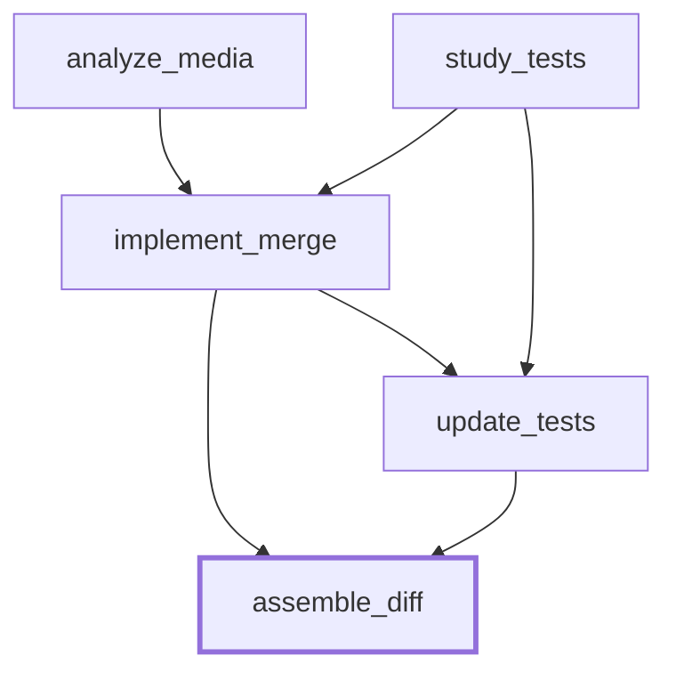

Plan-time observations:

- The harness embedded the fix design into the implementing node's instruction - "merges a LIST of lists (not just two)", "topological-sort-like algorithm" - compensating for the frozen-plan regime. Instructions survive every topology, so what a cut removes is the analyses' execution-time detail (the actual code, the exact test expectations), not the design outline.
- Discovered at the sequential pilot run, not at plan time: the gold FAIL_TO_PASS tests pin the reference implementation's internal API - they call Media.merge(*lists) positionally. An implementation with a different signature caps below 16/16 regardless of coordination, and the instruction's "list of lists" wording steers toward a single-argument signature. The task ceiling is therefore below 16 for this plan.
- The implementing node depends on both analysis nodes; the test-updating node depends on the implementation and the test analysis. Four dependency edges are cuttable.

### Haiku-harness decomposition (additional-runs grid)

For the additional-runs grid a haiku-harness decomposition of the same task was generated on 2026-08-12: identical frozen prompt, temperature 0, single turn, issued as a direct API call rather than through the Workbench UI (same endpoint, same parameters; the raw output is preserved unmodified in `graphs/django__django-11019.haiku.decomp.txt`). Seven nodes, no guards, rendered by the standard pipeline; diagrams appear under Rendered gradient topologies.

Two plan-time observations. First, the weak harness prefixed analysis prose to the JSON, a case the loader's repairs did not originally cover; `load_decomp` strips prose surrounding the outermost JSON object, logged like the existing repairs. Second, the plan declares a single writer per file (one node writes the implementation, a different node writes the tests), so it exposes no write-conflict surface: its parallel renderings vary read staleness and consumption order only, which predicts weaker topology sensitivity than under the opus plan.

## Rendered gradient topologies

<!-- TOPOLOGIES2:BEGIN -->

### django__django-11019 - haiku harness

**sequential** - 7 waves, max width 1

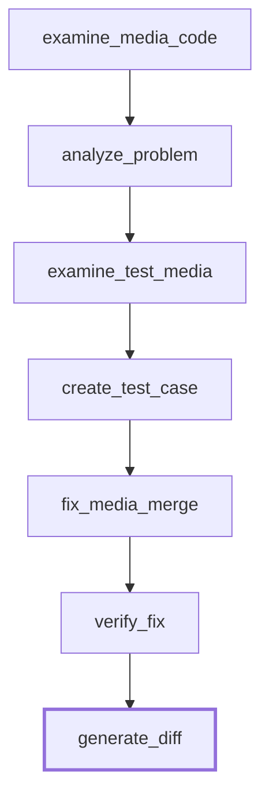

**parallel** - 5 waves, max width 2

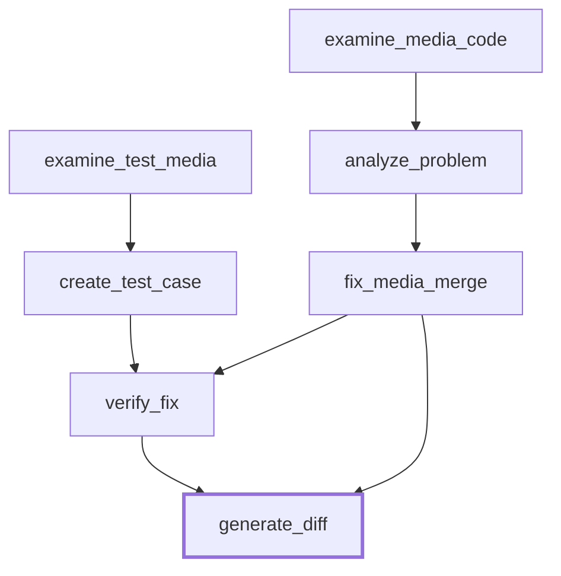

**cut25** - 4 waves, max width 4

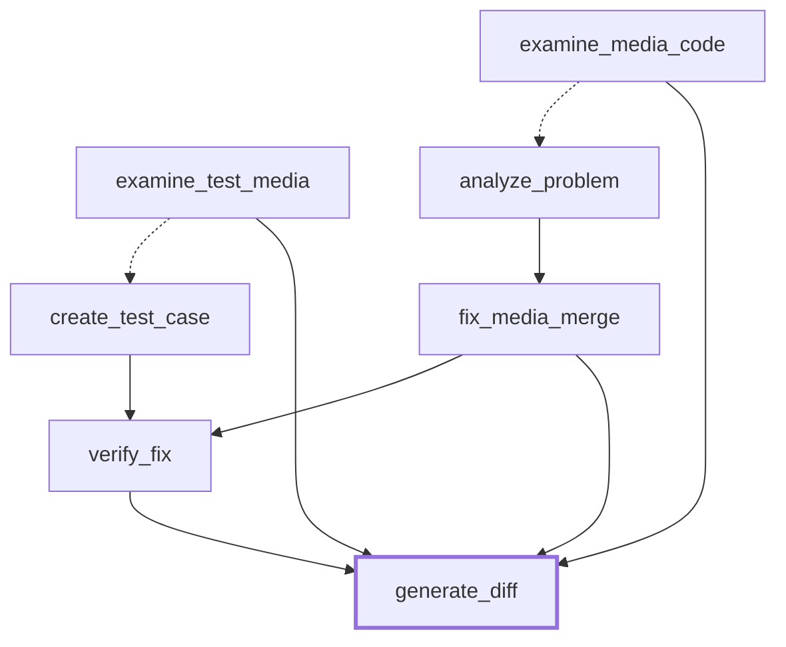

**cut50** - 3 waves, max width 5

```mermaid
flowchart TD
    examine_media_code[examine_media_code]
    examine_test_media[examine_test_media]
    analyze_problem[analyze_problem]
    create_test_case[create_test_case]
    fix_media_merge[fix_media_merge]
    verify_fix[verify_fix]
    generate_diff[generate_diff]
    examine_media_code -.-> analyze_problem
    examine_test_media -.-> create_test_case
    analyze_problem -.-> fix_media_merge
    create_test_case --> verify_fix
    fix_media_merge --> verify_fix
    fix_media_merge --> generate_diff
    verify_fix --> generate_diff
    examine_media_code --> generate_diff
    examine_test_media --> generate_diff
    analyze_problem --> generate_diff
    style generate_diff stroke-width:3px
```

**cut75** - 3 waves, max width 5

```mermaid
flowchart TD
    examine_media_code[examine_media_code]
    examine_test_media[examine_test_media]
    analyze_problem[analyze_problem]
    create_test_case[create_test_case]
    fix_media_merge[fix_media_merge]
    verify_fix[verify_fix]
    generate_diff[generate_diff]
    examine_media_code -.-> analyze_problem
    examine_test_media -.-> create_test_case
    analyze_problem -.-> fix_media_merge
    create_test_case -.-> verify_fix
    fix_media_merge --> verify_fix
    fix_media_merge --> generate_diff
    verify_fix --> generate_diff
    examine_media_code --> generate_diff
    examine_test_media --> generate_diff
    analyze_problem --> generate_diff
    create_test_case --> generate_diff
    style generate_diff stroke-width:3px
```

**overparallel** - 2 waves, max width 6

```mermaid
flowchart TD
    examine_media_code[examine_media_code]
    examine_test_media[examine_test_media]
    analyze_problem[analyze_problem]
    create_test_case[create_test_case]
    fix_media_merge[fix_media_merge]
    verify_fix[verify_fix]
    generate_diff[generate_diff]
    examine_media_code --> generate_diff
    examine_test_media --> generate_diff
    analyze_problem --> generate_diff
    examine_media_code -.-> analyze_problem
    create_test_case --> generate_diff
    examine_test_media -.-> create_test_case
    fix_media_merge --> generate_diff
    analyze_problem -.-> fix_media_merge
    verify_fix --> generate_diff
    create_test_case -.-> verify_fix
    fix_media_merge -.-> verify_fix
    style generate_diff stroke-width:3px
```

### django__django-11019 - opus harness

**sequential** - 5 waves, max width 1

```mermaid
flowchart TD
    analyze_media[analyze_media]
    study_tests[study_tests]
    implement_merge[implement_merge]
    update_tests[update_tests]
    assemble_diff[assemble_diff]
    analyze_media --> study_tests
    study_tests --> implement_merge
    implement_merge --> update_tests
    update_tests --> assemble_diff
    style assemble_diff stroke-width:3px
```

**parallel** - 4 waves, max width 2

```mermaid
flowchart TD
    analyze_media[analyze_media]
    study_tests[study_tests]
    implement_merge[implement_merge]
    update_tests[update_tests]
    assemble_diff[assemble_diff]
    analyze_media --> implement_merge
    study_tests --> implement_merge
    implement_merge --> update_tests
    study_tests --> update_tests
    implement_merge --> assemble_diff
    update_tests --> assemble_diff
    style assemble_diff stroke-width:3px
```

**cut25** - 4 waves, max width 2

```mermaid
flowchart TD
    analyze_media[analyze_media]
    study_tests[study_tests]
    implement_merge[implement_merge]
    update_tests[update_tests]
    assemble_diff[assemble_diff]
    analyze_media -.-> implement_merge
    study_tests --> implement_merge
    implement_merge --> update_tests
    study_tests --> update_tests
    implement_merge --> assemble_diff
    update_tests --> assemble_diff
    analyze_media --> assemble_diff
    style assemble_diff stroke-width:3px
```

**cut50** - 3 waves, max width 3

```mermaid
flowchart TD
    analyze_media[analyze_media]
    study_tests[study_tests]
    implement_merge[implement_merge]
    update_tests[update_tests]
    assemble_diff[assemble_diff]
    analyze_media -.-> implement_merge
    study_tests -.-> implement_merge
    implement_merge --> update_tests
    study_tests --> update_tests
    implement_merge --> assemble_diff
    update_tests --> assemble_diff
    analyze_media --> assemble_diff
    style assemble_diff stroke-width:3px
```

**cut75** - 3 waves, max width 3

```mermaid
flowchart TD
    analyze_media[analyze_media]
    study_tests[study_tests]
    implement_merge[implement_merge]
    update_tests[update_tests]
    assemble_diff[assemble_diff]
    analyze_media -.-> implement_merge
    study_tests -.-> implement_merge
    implement_merge -.-> update_tests
    study_tests --> update_tests
    implement_merge --> assemble_diff
    update_tests --> assemble_diff
    analyze_media --> assemble_diff
    style assemble_diff stroke-width:3px
```

**overparallel** - 2 waves, max width 4

```mermaid
flowchart TD
    analyze_media[analyze_media]
    study_tests[study_tests]
    implement_merge[implement_merge]
    update_tests[update_tests]
    assemble_diff[assemble_diff]
    analyze_media --> assemble_diff
    study_tests --> assemble_diff
    implement_merge --> assemble_diff
    analyze_media -.-> implement_merge
    study_tests -.-> implement_merge
    update_tests --> assemble_diff
    implement_merge -.-> update_tests
    study_tests -.-> update_tests
    style assemble_diff stroke-width:3px
```

### django__django-11019 - probe harness

**sequential** - 4 waves, max width 1

```mermaid
flowchart TD
    fix_css[fix_css]
    fix_js[fix_js]
    fix_merge[fix_merge]
    make_diff[make_diff]
    fix_css --> fix_js
    fix_js --> fix_merge
    fix_merge --> make_diff
    style make_diff stroke-width:3px
```

**parallel** - 2 waves, max width 3

```mermaid
flowchart TD
    fix_css[fix_css]
    fix_js[fix_js]
    fix_merge[fix_merge]
    make_diff[make_diff]
    fix_css --> make_diff
    fix_js --> make_diff
    fix_merge --> make_diff
    style make_diff stroke-width:3px
```

### django__django-11099 - probe harness

**sequential** - 3 waves, max width 1

```mermaid
flowchart TD
    fix_ascii[fix_ascii]
    fix_unicode[fix_unicode]
    make_diff[make_diff]
    fix_ascii --> fix_unicode
    fix_unicode --> make_diff
    style make_diff stroke-width:3px
```

**parallel** - 2 waves, max width 2

```mermaid
flowchart TD
    fix_ascii[fix_ascii]
    fix_unicode[fix_unicode]
    make_diff[make_diff]
    fix_ascii --> make_diff
    fix_unicode --> make_diff
    style make_diff stroke-width:3px
```

### django__django-11099 - probeordered harness

**parallel** - 3 waves, max width 1

```mermaid
flowchart TD
    fix_ascii[fix_ascii]
    fix_unicode[fix_unicode]
    make_diff[make_diff]
    fix_ascii --> fix_unicode
    fix_ascii --> make_diff
    fix_unicode --> make_diff
    style make_diff stroke-width:3px
```

### django__providing-args - probe harness

**sequential** - 5 waves, max width 1

```mermaid
flowchart TD
    t0_core_fix[t0_core_fix]
    t1_db_signals[t1_db_signals]
    t2_auth_signals[t2_auth_signals]
    t3_core_signals[t3_core_signals]
    make_diff[make_diff]
    t0_core_fix --> t1_db_signals
    t1_db_signals --> t2_auth_signals
    t2_auth_signals --> t3_core_signals
    t3_core_signals --> make_diff
    style make_diff stroke-width:3px
```

**parallel** - 3 waves, max width 3

```mermaid
flowchart TD
    t0_core_fix[t0_core_fix]
    t1_db_signals[t1_db_signals]
    t2_auth_signals[t2_auth_signals]
    t3_core_signals[t3_core_signals]
    make_diff[make_diff]
    t0_core_fix --> t1_db_signals
    t0_core_fix --> t2_auth_signals
    t0_core_fix --> t3_core_signals
    t0_core_fix --> make_diff
    t1_db_signals --> make_diff
    t2_auth_signals --> make_diff
    t3_core_signals --> make_diff
    style make_diff stroke-width:3px
```

### django__providing-args - probeordered harness

**parallel** - 4 waves, max width 2

```mermaid
flowchart TD
    t0_core_fix[t0_core_fix]
    t1_db_signals[t1_db_signals]
    t2_auth_signals[t2_auth_signals]
    t3_core_signals[t3_core_signals]
    make_diff[make_diff]
    t0_core_fix --> t1_db_signals
    t0_core_fix --> t2_auth_signals
    t1_db_signals --> t2_auth_signals
    t0_core_fix --> t3_core_signals
    t0_core_fix --> make_diff
    t1_db_signals --> make_diff
    t2_auth_signals --> make_diff
    t3_core_signals --> make_diff
    style make_diff stroke-width:3px
```

<!-- TOPOLOGIES2:END -->

## Gradient results

<!-- RESULTS2:BEGIN -->

### Gradient runs

content: fraction of the task rubric present in the patch. f2p: FAIL_TO_PASS tests passing / total. resolved: every FAIL_TO_PASS test passes. tokens: input + output tokens summed over nodes, prompt-cache reads excluded. All grades apply to the mechanical deliverable (the workspace diff).

| task | harness | agent | topology | wall (s) | cost ($) | tokens | node errors | premature consumptions | stale reads | write conflicts | content | f2p | resolved |
|---|---|---|---|---|---|---|---|---|---|---|---|---|---|
| django-11019 | opus | haiku | sequential | 185.11 | 0.2496 | 124306 | 0 | 0 | 0 | 0 | 1.0 | 6/16 | no |
| django-11019 | opus | haiku | sequential | 179.1 | 0.2455 | 123124 | 0 | 0 | 0 | 0 | 1.0 | 2/16 | no |
| django-11019 | opus | haiku | sequential | 185.8 | 0.2458 | 121050 | 0 | 0 | 0 | 0 | 1.0 | 4/16 | no |
| django-11019 | opus | haiku | sequential | 266.49 | 0.3221 | 148344 | 0 | 0 | 0 | 0 | 1.0 | 6/16 | no |
| django-11019 | opus | haiku | sequential | 198.14 | 0.2659 | 130543 | 0 | 0 | 0 | 0 | 1.0 | 9/16 | no |
| django-11019 | opus | haiku | parallel | 159.36 | 0.172 | 84333 | 1 | 0 | 0 | 0 | 1.0 | 6/16 | no |
| django-11019 | opus | haiku | parallel | 168.55 | 0.2573 | 126763 | 0 | 0 | 0 | 0 | 1.0 | 4/16 | no |
| django-11019 | opus | haiku | parallel | 169.78 | 0.2562 | 126173 | 0 | 0 | 0 | 0 | 1.0 | 4/16 | no |
| django-11019 | opus | haiku | parallel | 172.61 | 0.2573 | 126609 | 0 | 0 | 0 | 0 | 1.0 | 5/16 | no |
| django-11019 | opus | haiku | parallel | 160.95 | 0.2385 | 119640 | 0 | 0 | 0 | 0 | 1.0 | 3/16 | no |
| django-11019 | opus | haiku | cut25 | 171.53 | 0.2523 | 124656 | 0 | 0 | 0 | 0 | 1.0 | 4/16 | no |
| django-11019 | opus | haiku | cut25 | 184.64 | 0.2617 | 127309 | 0 | 0 | 0 | 0 | 1.0 | 6/16 | no |
| django-11019 | opus | haiku | cut25 | 177.69 | 0.25 | 123109 | 0 | 0 | 0 | 0 | 1.0 | 7/16 | no |
| django-11019 | opus | haiku | cut25 | 178.0 | 0.2604 | 127448 | 0 | 0 | 0 | 0 | 1.0 | 7/16 | no |
| django-11019 | opus | haiku | cut25 | 176.84 | 0.2581 | 125779 | 1 | 0 | 0 | 0 | 1.0 | 3/16 | no |
| django-11019 | opus | haiku | cut50 | 160.47 | 0.2559 | 121589 | 0 | 1 | 1 | 0 | 1.0 | 7/16 | no |
| django-11019 | opus | haiku | cut50 | 151.33 | 0.2489 | 119940 | 0 | 1 | 1 | 0 | 1.0 | 1/16 | no |
| django-11019 | opus | haiku | cut50 | 147.49 | 0.2574 | 122905 | 0 | 1 | 1 | 0 | 1.0 | 5/16 | no |
| django-11019 | opus | haiku | cut50 | 144.6 | 0.2463 | 119111 | 1 | 1 | 1 | 0 | 1.0 | 3/16 | no |
| django-11019 | opus | haiku | cut50 | 142.53 | 0.2456 | 118246 | 0 | 1 | 1 | 0 | 1.0 | 1/16 | no |
| django-11019 | opus | haiku | cut75 | 156.37 | 0.2612 | 122415 | 0 | 1 | 1 | 0 | 1.0 | 1/16 | no |
| django-11019 | opus | haiku | cut75 | 146.35 | 0.2497 | 120335 | 0 | 1 | 1 | 0 | 1.0 | 6/16 | no |
| django-11019 | opus | haiku | cut75 | 220.7 | 0.3119 | 140489 | 0 | 1 | 1 | 0 | 1.0 | 2/16 | no |
| django-11019 | opus | haiku | cut75 | 139.59 | 0.2465 | 119218 | 0 | 1 | 1 | 0 | 1.0 | 4/16 | no |
| django-11019 | opus | haiku | cut75 | 143.46 | 0.2403 | 117564 | 0 | 1 | 1 | 0 | 1.0 | 3/16 | no |
| django-11019 | opus | haiku | overparallel | 95.29 | 0.2275 | 104580 | 0 | 2 | 2 | 0 | 1.0 | 5/16 | no |
| django-11019 | opus | haiku | overparallel | 83.21 | 0.2293 | 104731 | 0 | 2 | 2 | 0 | 1.0 | 6/16 | no |
| django-11019 | opus | haiku | overparallel | 92.34 | 0.2316 | 105518 | 0 | 2 | 2 | 0 | 1.0 | 4/16 | no |
| django-11019 | opus | haiku | overparallel | 90.25 | 0.2278 | 104375 | 0 | 2 | 2 | 0 | 1.0 | 6/16 | no |
| django-11019 | opus | haiku | overparallel | 96.75 | 0.2337 | 105806 | 0 | 2 | 2 | 0 | 1.0 | 2/16 | no |

### Coordination events by topology

**sequential** (5 runs) - no events

**parallel** (4 runs) - no events

**parallel** (1 run)
- node error at `update_tests`

**cut25** (4 runs) - no events

**cut25** (1 run)
- node error at `update_tests`

**cut50** (1 run)
- node error at `update_tests`
- premature consumption at `implement_merge`
- stale read: `analyze_media` read `django/forms/widgets.py` while `implement_merge` rewrote it in the same superstep

**cut50** (4 runs, identical event set)
- premature consumption at `implement_merge`
- stale read: `analyze_media` read `django/forms/widgets.py` while `implement_merge` rewrote it in the same superstep

**cut75** (5 runs, identical event set)
- premature consumption at `implement_merge`
- stale read: `analyze_media` read `django/forms/widgets.py` while `implement_merge` rewrote it in the same superstep

**overparallel** (5 runs, identical event set)
- premature consumption at `implement_merge`
- premature consumption at `update_tests`
- stale read: `analyze_media` read `django/forms/widgets.py` while `implement_merge` rewrote it in the same superstep
- stale read: `study_tests` read `tests/forms_tests/tests/test_media.py` while `update_tests` rewrote it in the same superstep


### Means per topology

| topology | runs | wall (s) | cost ($) | tokens | node errors | premature consumptions | stale reads | write conflicts | content | f2p frac | resolved |
|---|---|---|---|---|---|---|---|---|---|---|---|
| sequential | 5 | 202.9 | 0.2658 | 129473.0 | 0.0 | 0.0 | 0.0 | 0.0 | 1.0 | 0.337 | 0/5 |
| parallel | 5 | 166.2 | 0.2363 | 116704.0 | 0.2 | 0.0 | 0.0 | 0.0 | 1.0 | 0.275 | 0/5 |
| cut25 | 5 | 177.7 | 0.2565 | 125660.0 | 0.2 | 0.0 | 0.0 | 0.0 | 1.0 | 0.338 | 0/5 |
| cut50 | 5 | 149.3 | 0.2508 | 120358.0 | 0.2 | 1.0 | 1.0 | 0.0 | 1.0 | 0.212 | 0/5 |
| cut75 | 5 | 161.3 | 0.2619 | 124004.0 | 0.0 | 1.0 | 1.0 | 0.0 | 1.0 | 0.2 | 0/5 |
| overparallel | 5 | 91.6 | 0.23 | 105002.0 | 0.0 | 2.0 | 2.0 | 0.0 | 1.0 | 0.287 | 0/5 |

Identical-schedule controls (pairs whose effective schedules coincide; their distributions must be indistinguishable if the rig is sound): parallel vs cut25: mean f2p 0.275 vs 0.338; cut50 vs cut75: mean f2p 0.212 vs 0.2.

### Write-conflict probe

The write-conflict probe isolates the coordination mechanism from worker capability. Its plan is authored rather than harness-generated, and disclosed as such: the reference fix touches two independent regions of one small file, each region assigned to one worker whose instruction contains the exact edit, so every individual worker action is correct by construction and capability is held at ceiling. The only variable left is the schedule. Sequentially, each worker receives the file with the previous edit already present and preserves it, so the edits compose. In parallel, both workers read the same snapshot and each commits a complete file containing only its own edit; the store keeps the last write and the other worker's committed correct work is destroyed - the lost update of concurrency-control theory, recorded as a write conflict in the failure vocabulary. The probe targets django-11099 because its file is small enough that whole-file reproduction is error-free, removing copy fidelity as a confound.

| task | harness | agent | topology | wall (s) | cost ($) | tokens | node errors | premature consumptions | stale reads | write conflicts | content | f2p | resolved |
|---|---|---|---|---|---|---|---|---|---|---|---|---|---|
| django-11099 | probe | haiku | sequential | 9.61 | 0.0132 | 2996 | 0 | 0 | 0 | 0 | 1.0 | 3/3 | yes |
| django-11099 | probe | haiku | sequential | 9.32 | 0.0166 | 3058 | 0 | 0 | 0 | 0 | 1.0 | 3/3 | yes |
| django-11099 | probe | haiku | sequential | 9.86 | 0.0166 | 3068 | 0 | 0 | 0 | 0 | 1.0 | 3/3 | yes |
| django-11099 | probe | haiku | sequential | 13.68 | 0.0162 | 2920 | 0 | 0 | 0 | 0 | 1.0 | 3/3 | yes |
| django-11099 | probe | haiku | sequential | 10.49 | 0.0163 | 2946 | 0 | 0 | 0 | 0 | 1.0 | 3/3 | yes |
| django-11099 | probe | haiku | parallel | 7.65 | 0.0177 | 3317 | 0 | 0 | 2 | 1 | 0.5 | 2/3 | no |
| django-11099 | probe | haiku | parallel | 8.59 | 0.0174 | 3301 | 0 | 0 | 2 | 1 | 0.5 | 2/3 | no |
| django-11099 | probe | haiku | parallel | 9.03 | 0.0167 | 2994 | 0 | 0 | 2 | 1 | 0.5 | 2/3 | no |
| django-11099 | probe | haiku | parallel | 6.78 | 0.0165 | 3005 | 0 | 0 | 2 | 1 | 0.5 | 2/3 | no |
| django-11099 | probe | haiku | parallel | 6.58 | 0.0167 | 2983 | 0 | 0 | 2 | 1 | 0.5 | 2/3 | no |

#### Ordered arm - the primitive applied

The ordered arm applies the coordination primitive to the failing schedule. Exactly one thing changes relative to the unordered probe: the plan declares a single dependency edge between the two writers (fix_unicode depends on fix_ascii). Instructions, agent model, renderer, and grading are identical. The renderer turns the declared edge into an ordering constraint, so the second writer starts only after the first has committed, receives the file with the first edit already present, and preserves it - the write sets no longer overlap within a superstep, so the lost update cannot occur. This is the standard concurrency-control remedy for a write-write conflict, applied statically: serialize exactly the conflicting pair and nothing else.

| task | harness | agent | topology | wall (s) | cost ($) | tokens | node errors | premature consumptions | stale reads | write conflicts | content | f2p | resolved |
|---|---|---|---|---|---|---|---|---|---|---|---|---|---|
| django-11099 | probeordered | haiku | parallel | 11.19 | 0.0134 | 3304 | 0 | 0 | 0 | 0 | 1.0 | 3/3 | yes |
| django-11099 | probeordered | haiku | parallel | 8.95 | 0.0166 | 3313 | 0 | 0 | 0 | 0 | 1.0 | 3/3 | yes |
| django-11099 | probeordered | haiku | parallel | 9.55 | 0.0166 | 3298 | 0 | 0 | 0 | 0 | 1.0 | 3/3 | yes |
| django-11099 | probeordered | haiku | parallel | 12.82 | 0.0167 | 3353 | 0 | 0 | 0 | 0 | 1.0 | 3/3 | yes |
| django-11099 | probeordered | haiku | parallel | 13.8 | 0.0183 | 3831 | 0 | 0 | 0 | 0 | 1.0 | 3/3 | yes |

- sequential (implicit total order): 5/5 resolved; content values [1.0]; same-superstep stale reads per run [0]; write conflicts per run [0].
- parallel, unordered writers: 0/5 resolved; content values [0.5]; same-superstep stale reads per run [2]; write conflicts per run [1].
- parallel, one declared ordering edge (the primitive): 5/5 resolved; content values [1.0]; same-superstep stale reads per run [0]; write conflicts per run [0].

The outcome flip is schedule-derived: every unordered parallel repetition lost the same edit to the same last-write-wins conflict while the sampled worker outputs varied. The ordered arm shows the repair: one declared dependency between the conflicting writers restores resolution. In this minimal probe the conflicting pair is the entire graph, so serializing it recovers the sequential schedule; the wall-time case for parallelism rests on the gradient runs, where non-conflicting work parallelizes with no accuracy loss under the same state discipline.

<!-- RESULTS2:END -->

## Paper-figure probe - providing_args removal

The paper's Figure 1 presents the removal of the deprecated `providing_args` argument from Django's Signal API as its running example. This probe executes that workflow with the write-conflict probe methodology: the plan is authored rather than harness-generated, disclosed as such, with exact-edit instructions so every individual worker action is correct by construction and the schedule is the only variable.

### Summary

- The task is real: Django's Signal class took a `providing_args` list that was stored and never used, and Django later deleted it. The task here is that deletion: remove the argument from the class and from roughly twenty places across seven files that still pass it. The workflow had previously served only as an illustration; here it is executed against a real codebase.
- The plan is the figure's, written by hand: t0 fixes the core class, t1/t2/t3 each clean one group of files. Every worker's instruction contains its exact edits, so no worker can fail on its own. Any failure is therefore attributable to coordination alone.
- The conflict is built into the plan: t1 and t2 must both edit the same test file, in different regions, and workers hand back whole files.
- **Sequential.** One worker runs at a time. t2 receives the file with t1's edit already present and keeps it. Both edits survive.
- **Parallel, unordered.** t1 and t2 run at the same time, both starting from the same copy of the shared file, each returning a full file containing only its own edits. The store keeps whichever lands last - t2's, every time - and t1's finished, correct work is silently erased. The erased lines still pass the argument the core class no longer accepts, so the test suite crashes at import. This is the lost update of concurrency-control theory.
- **Parallel, one ordering edge.** Identical to the above, plus a single declared ordering: t2 waits for t1. t3 still runs alongside t1. The failure disappears and the run stays faster than sequential.

### Task construction

`django__providing-args` is an authored task, not a SWE-bench instance. It reuses the django-11019 base commit (93e892b), where `providing_args` is live at every site the upstream removal later touched. The plan maps to the figure's DAG: `t0_core_fix` edits `django/dispatch/dispatcher.py` (constructor signature, stored attribute, docstrings); `t1_db_signals` edits `django/db/models/signals.py` (11 construction sites); `t2_auth_signals` edits `django/contrib/auth/signals.py` (3 sites); `t3_core_signals` edits `django/core/signals.py`, `django/db/backends/signals.py`, and `django/test/signals.py` (5 sites); `make_diff` is the barriered final node. t1, t2, and t3 each declare a dependency on t0 - the figure's signature reads - so t0 occupies the first superstep in every rendering.

The repository corrects the figure in three places. The shared fixture both t1 and t2 write is `tests/dispatch/tests.py`, not `tests/signals/tests.py`, which contains no `providing_args`: t1 owns the `a_signal`/`b_signal` constructions, t2 owns `c_signal`/`d_signal`, and both reproduce the whole file. The third slice covers the core signal modules rather than `core/handlers/`, which has no `providing_args`. And `django/utils/autoreload.py` is handled as task preparation rather than probe work: `django.utils.translation` imports it at module level and translation is on the import path of `django.test`, so its single construction site breaks every test run once the constructor drops the parameter - but assigning it to a worker would put a 630-line whole-file reproduction in the write set for a one-line edit, reintroducing the copy-fidelity confound the probe design exists to remove. Its removal is applied and committed by task setup, part of the graded base state and outside the probe's write set.

### Grading

The task has no gold patch, so the gate is authored and disclosed: six regression tests across `tests/dispatch` and `tests/signals`, all passing at the base commit, listed as FAIL_TO_PASS so the existing grader runs them unchanged. They gate the composed refactor rather than a bug fix, so resolved reads jointly with content here: content anchors the two shared-fixture regions (`a_signal` for t1, `c_signal` for t2), and a lost update on the shared file grades content 0.5. The expected parallel failure is loud by construction - the losing worker's constructions still pass `providing_args` to the constructor t0 removed, and the dispatch module dies at import with a TypeError: every agent acted correctly, the composed state is broken. The gold test patch is a marker-file creation only, so the shared fixture the probe writes stays inside the graded diff.

### Arms

- **sequential** - t0, t1, t2, t3, make_diff in total order; the second shared-fixture writer receives the file with the first edit already present and preserves it.
- **parallel, unordered** - t0 alone in the first superstep, t1-t3 concurrent in the second. t1 and t2 read the same snapshot of the shared test file and each commits a complete file containing only its own edits; the store keeps the last write - the lost update.
- **parallel, ordered** - one declared dependency edge, t2 after t1. Unlike the django-11099 ordered arm, where the conflicting pair was the entire graph, t3 still runs concurrently with t1: the primitive serializes exactly the conflicting pair and preserves the residual parallelism.

Rendered topologies for the probe and probeordered plans appear in the rendered-topologies block above.

<!-- RESULTS3:BEGIN -->

### Runs

content: fraction of the task rubric present in the patch. f2p: FAIL_TO_PASS tests passing / total. resolved: every FAIL_TO_PASS test passes. tokens: input + output tokens summed over nodes, prompt-cache reads excluded. All grades apply to the mechanical deliverable (the workspace diff).

| task | harness | agent | topology | wall (s) | cost ($) | tokens | node errors | premature consumptions | stale reads | write conflicts | content | f2p | resolved |
|---|---|---|---|---|---|---|---|---|---|---|---|---|---|
| providing-args | probe | haiku | sequential | 79.79 | 0.107 | 48789 | 0 | 0 | 0 | 0 | 1.0 | 6/6 | yes |
| providing-args | probe | haiku | sequential | 106.93 | 0.1199 | 51476 | 0 | 0 | 0 | 0 | 1.0 | 6/6 | yes |
| providing-args | probe | haiku | sequential | 80.94 | 0.1108 | 48982 | 0 | 0 | 0 | 0 | 1.0 | 6/6 | yes |
| providing-args | probe | haiku | sequential | 83.0 | 0.1116 | 49097 | 0 | 0 | 0 | 0 | 1.0 | 6/6 | yes |
| providing-args | probe | haiku | sequential | 81.08 | 0.1109 | 49016 | 0 | 0 | 0 | 0 | 1.0 | 6/6 | yes |
| providing-args | probe | haiku | parallel | 50.22 | 0.111 | 48941 | 0 | 0 | 2 | 1 | 0.5 | 2/6 | no |
| providing-args | probe | haiku | parallel | 48.49 | 0.1114 | 49169 | 0 | 0 | 2 | 1 | 0.5 | 2/6 | no |
| providing-args | probe | haiku | parallel | 67.27 | 0.1217 | 51177 | 0 | 0 | 2 | 1 | 0.5 | 2/6 | no |
| providing-args | probe | haiku | parallel | 47.72 | 0.1081 | 48404 | 0 | 0 | 2 | 1 | 0.5 | 2/6 | no |
| providing-args | probe | haiku | parallel | 48.74 | 0.1105 | 48961 | 0 | 0 | 2 | 1 | 0.5 | 2/6 | no |

#### Ordered arm

| task | harness | agent | topology | wall (s) | cost ($) | tokens | node errors | premature consumptions | stale reads | write conflicts | content | f2p | resolved |
|---|---|---|---|---|---|---|---|---|---|---|---|---|---|
| providing-args | probeordered | haiku | parallel | 65.08 | 0.1133 | 51987 | 0 | 0 | 0 | 0 | 1.0 | 6/6 | yes |
| providing-args | probeordered | haiku | parallel | 70.03 | 0.1126 | 51734 | 0 | 0 | 0 | 0 | 1.0 | 6/6 | yes |
| providing-args | probeordered | haiku | parallel | 64.02 | 0.1129 | 51874 | 0 | 0 | 0 | 0 | 1.0 | 6/6 | yes |
| providing-args | probeordered | haiku | parallel | 66.48 | 0.1151 | 52389 | 0 | 0 | 0 | 0 | 1.0 | 6/6 | yes |
| providing-args | probeordered | haiku | parallel | 83.99 | 0.1259 | 54400 | 0 | 0 | 0 | 0 | 1.0 | 6/6 | yes |

- sequential (implicit total order): 5/5 resolved; f2p values ['6/6']; content values [1.0]; same-superstep stale reads per run [0]; write conflicts per run [0].
- parallel, unordered writers: 0/5 resolved; f2p values ['2/6']; content values [0.5]; same-superstep stale reads per run [2]; write conflicts per run [1].
- parallel, conflicting pair ordered (t2_auth_signals after t1_db_signals): 5/5 resolved; f2p values ['6/6']; content values [1.0]; same-superstep stale reads per run [0]; write conflicts per run [0].

<!-- RESULTS3:END -->

### Reading of the runs

All fifteen runs are deterministic on every graded axis. The sequential and ordered arms resolve 5/5 at 6/6 tests with content 1.0; the unordered parallel arm fails 5/5 at 2/6 with content 0.5, the same two stale reads, the same single write conflict, and the same loser - t2's commit lands last and erases t1's shared-fixture edits in every repetition. The sampled worker outputs vary; the outcome does not. Correctness here is a property of the schedule, not of any agent.

The ordered arm is the headline result, and it is not a retreat to sequential execution. One declared edge serializes exactly the conflicting pair while t3 runs concurrently with t1, and mean wall time stays below sequential (66-84s vs 80-107s; unordered parallel 48-67s). The remedy costs part of the parallelism, not all of it, which is the concurrency-control claim in miniature.

Relative to the django-11099 probe this adds three things: the conflict sits inside a five-node multi-file workflow rather than a minimal pair, the oracle is the repository's own test suite rather than an instance's gold tests, and the primitive demonstrably preserves residual parallelism instead of collapsing the graph to a total order.

## Additional runs

<!-- ADDITIONAL:BEGIN -->

### django-11019 - haiku harness, haiku agent

| task | harness | agent | topology | wall (s) | cost ($) | tokens | node errors | premature consumptions | stale reads | write conflicts | content | f2p | resolved |
|---|---|---|---|---|---|---|---|---|---|---|---|---|---|
| django-11019 | haiku | haiku | sequential | 224.28 | 0.3086 | 159793 | 0 | 0 | 0 | 0 | 1.0 | 4/16 | no |
| django-11019 | haiku | haiku | sequential | 204.93 | 0.2987 | 153342 | 0 | 0 | 0 | 0 | 1.0 | 1/16 | no |
| django-11019 | haiku | haiku | sequential | 183.44 | 0.2832 | 150283 | 0 | 0 | 0 | 0 | 0.5 | 1/16 | no |
| django-11019 | haiku | haiku | sequential | 167.76 | 0.2719 | 147930 | 0 | 0 | 0 | 0 | 1.0 | 1/16 | no |
| django-11019 | haiku | haiku | sequential | 186.15 | 0.2848 | 151262 | 0 | 0 | 0 | 0 | 1.0 | 6/16 | no |
| django-11019 | haiku | haiku | parallel | 182.05 | 0.2961 | 154248 | 0 | 0 | 0 | 0 | 1.0 | 1/16 | no |
| django-11019 | haiku | haiku | parallel | 169.84 | 0.2912 | 152375 | 0 | 0 | 0 | 0 | 0.5 | 2/16 | no |
| django-11019 | haiku | haiku | parallel | 162.45 | 0.2864 | 152253 | 0 | 0 | 0 | 0 | 0.5 | 4/16 | no |
| django-11019 | haiku | haiku | parallel | 188.75 | 0.3039 | 154592 | 0 | 0 | 0 | 0 | 0.5 | 2/16 | no |
| django-11019 | haiku | haiku | parallel | 165.44 | 0.2834 | 151093 | 0 | 0 | 0 | 0 | 1.0 | 3/16 | no |
| django-11019 | haiku | haiku | overparallel | 99.93 | 0.263 | 126556 | 0 | 4 | 5 | 0 | 0.5 | 1/16 | no |
| django-11019 | haiku | haiku | overparallel | 170.04 | 0.3352 | 150699 | 0 | 4 | 5 | 0 | 0.5 | 1/16 | no |
| django-11019 | haiku | haiku | overparallel | 88.88 | 0.2564 | 125549 | 0 | 4 | 5 | 0 | 1.0 | 0/16 | no |
| django-11019 | haiku | haiku | overparallel | 94.84 | 0.2551 | 124663 | 0 | 4 | 5 | 0 | 0.5 | 1/16 | no |
| django-11019 | haiku | haiku | overparallel | 104.72 | 0.2653 | 126805 | 0 | 4 | 5 | 0 | 0.5 | 1/16 | no |

### django-11019 - haiku harness, opus agent

| task | harness | agent | topology | wall (s) | cost ($) | tokens | node errors | premature consumptions | stale reads | write conflicts | content | f2p | resolved |
|---|---|---|---|---|---|---|---|---|---|---|---|---|---|
| django-11019 | haiku | opus | sequential | 507.8 | 2.1256 | 217124 | 0 | 0 | 0 | 0 | 1.0 | 16/16 | yes |
| django-11019 | haiku | opus | sequential | 446.56 | 2.1286 | 216187 | 0 | 0 | 0 | 0 | 1.0 | 16/16 | yes |
| django-11019 | haiku | opus | sequential | 538.27 | 2.4882 | 244028 | 0 | 0 | 0 | 0 | 1.0 | 1/16 | no |
| django-11019 | haiku | opus | sequential | 459.94 | 2.1226 | 215785 | 0 | 0 | 0 | 0 | 1.0 | 16/16 | yes |
| django-11019 | haiku | opus | sequential | 596.79 | 2.6382 | 254896 | 0 | 0 | 0 | 0 | 1.0 | 1/16 | no |
| django-11019 | haiku | opus | parallel | 454.57 | 2.3234 | 233527 | 0 | 0 | 0 | 0 | 1.0 | 1/16 | no |
| django-11019 | haiku | opus | parallel | 399.27 | 2.1597 | 218247 | 0 | 0 | 0 | 0 | 1.0 | 16/16 | yes |
| django-11019 | haiku | opus | parallel | 542.26 | 2.5222 | 242335 | 0 | 0 | 0 | 0 | 1.0 | 16/16 | yes |
| django-11019 | haiku | opus | parallel | 409.15 | 2.163 | 218216 | 0 | 0 | 0 | 0 | 1.0 | 16/16 | yes |
| django-11019 | haiku | opus | parallel | 396.61 | 2.1418 | 216962 | 0 | 0 | 0 | 0 | 1.0 | 2/16 | no |
| django-11019 | haiku | opus | overparallel | 262.68 | 2.0133 | 181696 | 0 | 4 | 5 | 0 | 1.0 | 16/16 | yes |
| django-11019 | haiku | opus | overparallel | 262.78 | 1.9128 | 175091 | 0 | 4 | 5 | 0 | 1.0 | 3/16 | no |
| django-11019 | haiku | opus | overparallel | 255.95 | 1.9517 | 177740 | 0 | 4 | 5 | 0 | 1.0 | 3/16 | no |
| django-11019 | haiku | opus | overparallel | 238.46 | 1.9019 | 175491 | 0 | 4 | 5 | 0 | 1.0 | 16/16 | yes |
| django-11019 | haiku | opus | overparallel | 241.35 | 1.9222 | 176793 | 0 | 4 | 5 | 0 | 1.0 | 16/16 | yes |

### providing-args - authored plans, opus agent

| task | harness | agent | topology | wall (s) | cost ($) | tokens | node errors | premature consumptions | stale reads | write conflicts | content | f2p | resolved |
|---|---|---|---|---|---|---|---|---|---|---|---|---|---|
| providing-args | probe | opus | sequential | 125.92 | 0.6757 | 63972 | 0 | 0 | 0 | 0 | 1.0 | 6/6 | yes |
| providing-args | probe | opus | sequential | 123.04 | 0.6963 | 63941 | 0 | 0 | 0 | 0 | 1.0 | 6/6 | yes |
| providing-args | probe | opus | sequential | 121.71 | 0.6924 | 63783 | 0 | 0 | 0 | 0 | 1.0 | 6/6 | yes |
| providing-args | probe | opus | sequential | 119.67 | 0.6929 | 63807 | 0 | 0 | 0 | 0 | 1.0 | 6/6 | yes |
| providing-args | probe | opus | sequential | 120.58 | 0.6922 | 63777 | 0 | 0 | 0 | 0 | 1.0 | 6/6 | yes |
| providing-args | probe | opus | parallel | 73.69 | 0.6984 | 64113 | 0 | 0 | 2 | 1 | 0.5 | 2/6 | no |
| providing-args | probe | opus | parallel | 68.8 | 0.6958 | 63965 | 0 | 0 | 2 | 1 | 0.5 | 2/6 | no |
| providing-args | probe | opus | parallel | 68.12 | 0.6954 | 63950 | 0 | 0 | 2 | 1 | 0.5 | 2/6 | no |
| providing-args | probe | opus | parallel | 68.62 | 0.6977 | 64039 | 0 | 0 | 2 | 1 | 0.5 | 2/6 | no |
| providing-args | probe | opus | parallel | 68.6 | 0.6969 | 64010 | 0 | 0 | 2 | 1 | 0.5 | 2/6 | no |

### providing-args - ordered arm, opus agent

| task | harness | agent | topology | wall (s) | cost ($) | tokens | node errors | premature consumptions | stale reads | write conflicts | content | f2p | resolved |
|---|---|---|---|---|---|---|---|---|---|---|---|---|---|
| providing-args | probeordered | opus | parallel | 99.95 | 0.7223 | 68314 | 0 | 0 | 0 | 0 | 1.0 | 6/6 | yes |
| providing-args | probeordered | opus | parallel | 101.16 | 0.7226 | 68427 | 0 | 0 | 0 | 0 | 1.0 | 6/6 | yes |
| providing-args | probeordered | opus | parallel | 98.69 | 0.7211 | 68307 | 0 | 0 | 0 | 0 | 1.0 | 6/6 | yes |
| providing-args | probeordered | opus | parallel | 98.04 | 0.716 | 67882 | 0 | 0 | 0 | 0 | 1.0 | 6/6 | yes |
| providing-args | probeordered | opus | parallel | 96.96 | 0.7142 | 67807 | 0 | 0 | 0 | 0 | 1.0 | 6/6 | yes |


<!-- ADDITIONAL:END -->